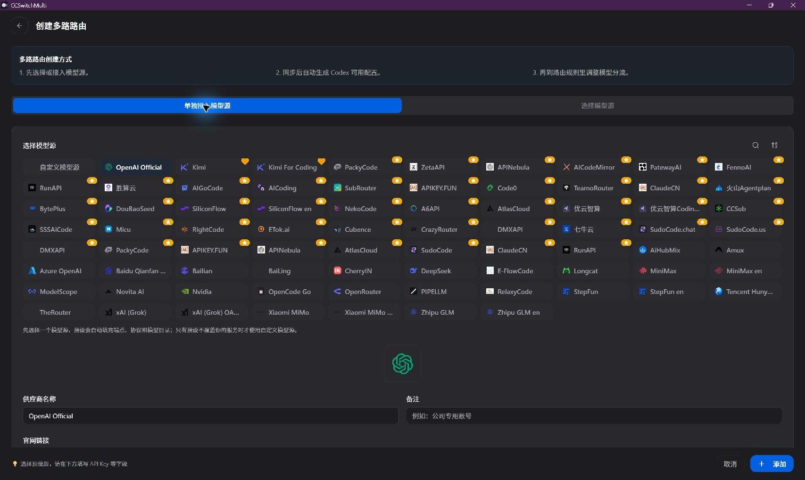
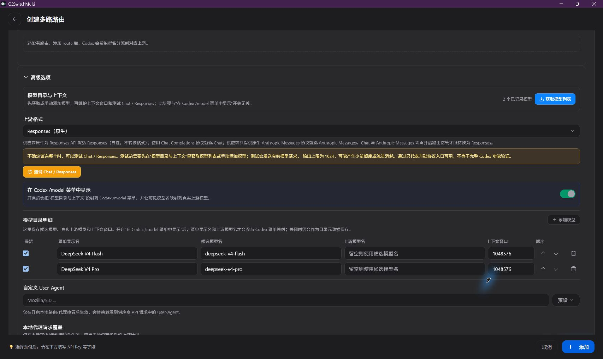
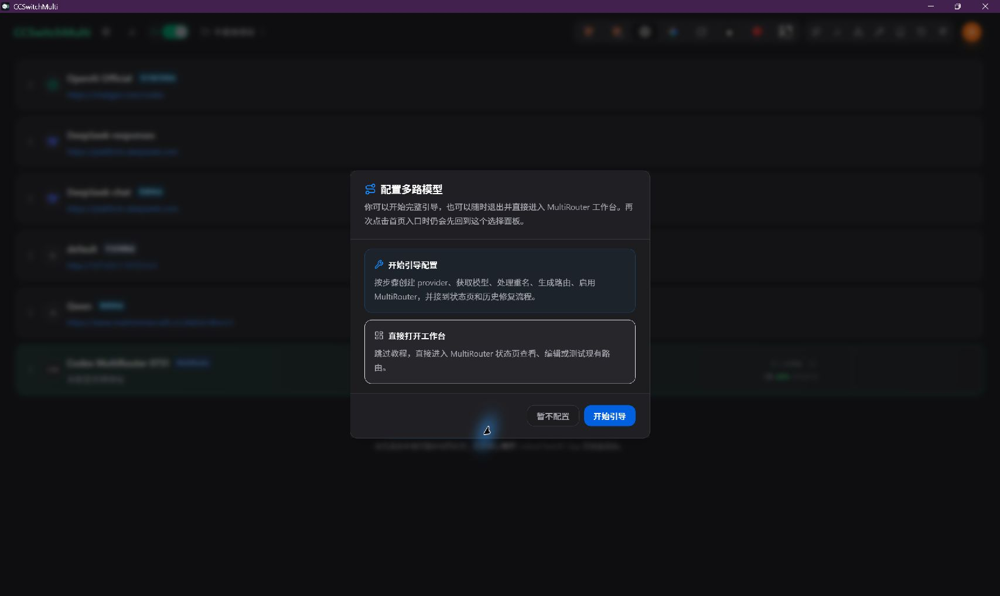
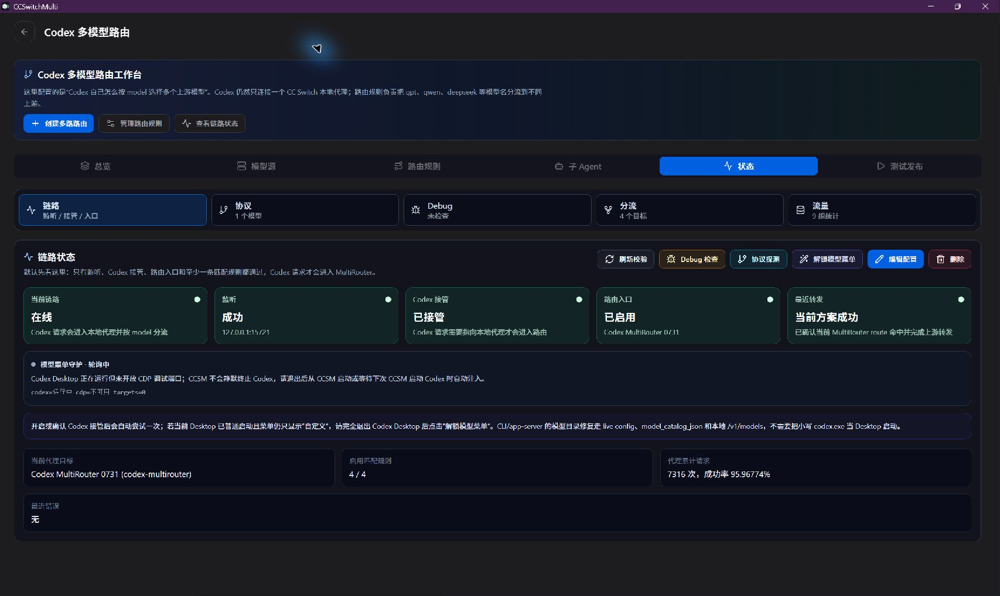
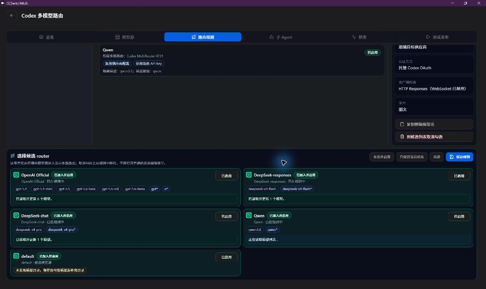

# Codex Provider 与 MultiRouter 配置体验审计

- 日期：2026-08-14
- 范围：Codex Provider 配置页、MultiRouter 创建入口、引导向导、工作台与状态诊断
- 结论性质：产品与信息架构设计；本轮不修改生产代码

## 结论先行

当前体验的根本问题不是单个开关放错位置，而是三代产品结构同时存在：

1. 旧 Provider 内“Codex 多模型路由”编辑线；
2. 一套把自动过程拆成 10 步的引导向导；
3. 已经能够独立完成模型源、路由、状态和发布的新 MultiRouter 工作台。

三者叠加后，Provider 页既像“接入一个模型源”，又像“编辑整个路由方案”；高级设置既包含专家覆盖，又藏着首次配置必需的模型同步和协议验证。用户因此需要先理解内部实现，才能完成本应自动化的正常配置。

推荐采用“任务流程型 Provider 页 + 四步 MultiRouter 向导”：

- Provider 页只负责把一个上游配置成健康、可路由的模型源；
- MultiRouter 工作台只负责组合健康模型源、生成路由、启用和诊断；
- 内置维护预设自动提供协议、模型能力、上下文、推理档位与 `/model` 投影；
- 自定义 Provider 先自动探测，只有探测失败或用户主动偏离预设时才出现技术覆盖项；
- 历史路由数据继续兼容读取和执行，但不再暴露旧编辑入口，也不再引导历史迁移或历史修复。

## 审计证据与限制

- 截图来自本机已安装的 CCSwitchMulti，可作为旧入口和当前交互负担的真实证据。
- 已安装版仍显示部分当前分支已经隐藏的旧 UI；结论同时核对了当前分支源码，不能把截图中的旧入口误判为需要恢复的功能。
- 当前分支 `CodexFormFields.tsx` 已固定 `canEditRouting = false`，说明 Provider 内路由编辑入口已经在源码中收口；历史 `codexRouting` schema、保存归一化和后端 resolver 仍需保留兼容。
- 本轮只做审计与设计，没有改动生产代码，也没有运行安装版替换。

## 真实流程与健康状态

| 步骤                  | 用户看到的现状                                    | 健康状态       | 判断                                           |
| --------------------- | ------------------------------------------------- | -------------- | ---------------------------------------------- |
| 1. 进入 Provider 列表 | 顶部、多路卡片和底部按钮重复提供 MultiRouter 入口 | 有风险         | 单 Provider 与路由方案对象混在同一层级         |
| 2. 新增配置           | 先询问“单独接入模型源 / 选择统一模型源”           | 可用但命名不清 | 应直接表述为“添加模型源 / 创建 MultiRouter”    |
| 3. 选择预设           | 预设卡片与 Provider 表单在同一长页                | 基本可用       | 预设身份应成为页面第一段，并显示维护状态       |
| 4. 配置连接           | API Key、Base URL 与大量低频字段混排              | 有风险         | 首次完成所需字段不够聚焦                       |
| 5. 获取模型与探测协议 | 被放入“高级设置”                                  | 阻塞主流程     | 这是模型源就绪的必经或条件必经动作，必须提升   |
| 6. 创建 MultiRouter   | 弹窗同时提供 10 步向导和工作台                    | 重复           | 应保留一个四步引导，完成后进入同一工作台       |
| 7. 生成路由           | 工作台已能选 Provider、读取模型并生成规则         | 健康           | 证明 Provider 内旧 route editor 不再有存在价值 |
| 8. 验证运行           | 状态页已有链路、协议、分流、流量、Debug           | 健康           | 诊断应集中在这里，不应重复塞回 Provider 高级项 |

## 当前界面证据

### Provider 选择与维护预设

预设选择是正确的新主线，但页面需要把“这个预设由 CCSwitchMulti 维护哪些能力”表达成明确状态，而不是让用户继续看到可编辑的底层实现字段。

### 维护预设的高级区仍过重

“获取模型列表、上游格式、协议测试、模型目录明细、Header/Body 覆盖”被放入同一个高级折叠，混合了首次就绪动作、自动状态和专家覆盖。对维护预设而言，协议和 reasoning 能力应由预设直接给出，用户只需验证连接。

### 两个 MultiRouter 入口并存

用户需要先判断自己应该“开始引导”还是“直接打开工作台”。推荐保留一个主入口：新方案进入四步引导，已有方案直接进入工作台；不再让用户选择产品内部的两套配置方式。

### 状态页已经具备正确的诊断职责

状态页已经围绕链路、协议、Debug、分流和流量组织，这正是运行态诊断应在的位置。“解锁模型菜单”等动作只在检测到具体异常时显示，不作为正常 Provider 配置步骤。

### 路由规则页已经替代 Provider 内旧 route editor

这里已经能够选择候选 Provider、读取模型并生成/调整路由。路由规则属于“多个模型源如何组合”，不属于“单个模型源如何连接”。

补充截图：

- [自定义 Provider 高级区现状](./01-custom-provider-advanced-current.png)
- [Provider 列表与重复路由入口](./02-provider-list-and-routing-entry.png)
- [创建模型源的入口选择](./03-multirouter-create-source-choice.png)
- [DeepSeek 预设主表单](./05-deepseek-preset-main.png)

## 控件完整分类

| 控件或能力                                | 当前问题                             | 新位置/行为                                             | 分类            |
| ----------------------------------------- | ------------------------------------ | ------------------------------------------------------- | --------------- |
| Provider 预设选择                         | 与长表单混排，维护边界不清           | Provider 页顶部，显示“由 CCSwitchMulti 维护”            | 主流程必经      |
| Provider 名称                             | 必要                                 | 模型源身份区                                            | 主流程必经      |
| 备注、官网                                | 占据主流程空间                       | 身份区的“更多信息”                                      | 可弱化          |
| OAuth 登录/账号状态                       | 与 API Key 模式混杂                  | 官方 OAuth Provider 的连接凭据区                        | 条件必经        |
| API Key                                   | 必要                                 | 连接凭据区                                              | 主流程必经      |
| Base URL                                  | 预设和自定义都可能可编辑             | 自定义必填；维护预设只读显示                            | 主流程/条件必经 |
| 端点管理                                  | 容易与 Base URL 重复                 | 仅多端点 Provider 展开                                  | 条件必经        |
| 获取模型列表                              | 藏在高级                             | “同步模型”主按钮，保存前自动尝试                        | 主流程必经      |
| 手动添加模型                              | 与正常同步并列                       | 仅 `/models` 不可用时出现                               | 条件必经        |
| 默认模型                                  | 隐藏在目录细节中                     | 模型与兼容性区                                          | 主流程必经      |
| 上游格式                                  | 要求用户提前理解协议                 | 维护预设只读；自定义自动探测后显示结论                  | 自动状态        |
| Chat / Responses 测试                     | 藏在高级且像两个独立任务             | 合并为“验证连接”；内部选择正确协议                      | 主流程/条件必经 |
| 双协议探测                                | 高级技术动作                         | 仅自定义/未知 Provider 自动执行；预计产生费用时提示     | 条件必经        |
| 手动协议选择                              | 容易造成错误覆盖                     | 自动探测失败后才开放                                    | 真正高级        |
| 上下文窗口                                | 要求用户维护易漂移数据               | 维护预设自动；自定义目录只显示结果                      | 自动状态        |
| reasoning 档位                            | 曾由多处硬编码造成漂移               | 维护预设按 Provider + 协议 + 模型解析；自定义未知不猜测 | 自动状态        |
| reasoning JSON 覆盖                       | 与正常目录编辑混在一起               | “创建高级覆盖”后出现，并显示偏离警告                    | 真正高级        |
| Anthropic auth/impersonation/max tokens   | 非所有 Provider 所需                 | 仅 Anthropic 兼容模式条件显示                           | 条件必经        |
| prompt cache routing                      | 低频实现细节                         | 高级自定义                                              | 真正高级        |
| 自定义 User-Agent                         | 低频                                 | 高级自定义                                              | 真正高级        |
| Header / Body 覆盖                        | 高风险且低频                         | 高级自定义，并提示可能改变兼容性                        | 真正高级        |
| 远程压缩                                  | Provider 级额外能力                  | 高级自定义                                              | 真正高级        |
| raw `auth.json` / `config.toml`           | 常驻页面造成认知负担                 | 专家配置；正常流程不展示                                | 真正高级        |
| 计费配置                                  | 与连接主流程关系弱                   | 高级自定义/独立计费入口                                 | 真正高级        |
| Goal mode                                 | Codex 全局行为，却放在单 Provider 页 | 移到全局 Codex 设置                                     | 移出 Provider   |
| 应用/编辑通用配置                         | 全局动作常驻每个 Provider            | 移到全局 Codex 设置                                     | 移出 Provider   |
| `/model` 菜单投影                         | 容易被误解为开启 MultiRouter         | 维护预设强制开启；自定义退出项放高级最后                | 自动/高级退出   |
| Provider 内多模型路由                     | 与工作台职责重复                     | 隐藏 UI，保留历史数据兼容                               | 旧设计隐藏      |
| 默认 route id / 添加 route / route Dialog | 单 Provider 页不该组装多源路由       | 只在 MultiRouter 工作台编辑                             | 旧设计隐藏      |
| 官方 route 认证策略                       | 属于路由候选选择                     | MultiRouter 路由/向导                                   | 移出 Provider   |
| 解锁模型菜单                              | 正常配置不应主动操作                 | 状态页检测失败时才显示修复操作                          | 条件诊断        |
| 历史修复/迁移引导                         | 已不属于正常配置目标                 | 从向导和完成文案中删除                                  | 旧设计删除      |

## 推荐 Provider 页面结构

### 1. 模型源身份

- 预设选择与预设维护状态；
- Provider 名称；
- 备注、官网折叠为“更多信息”。

### 2. 连接凭据

- OAuth 或 API Key；
- Base URL；
- 多端点 Provider 才显示端点管理；
- 维护预设值只读显示，避免无意偏离。

### 3. 模型与兼容性

- “同步模型”主按钮；
- 已发现模型数量与摘要；
- 默认模型；
- 协议与连接状态；
- 一个统一的“验证连接”动作；
- 失败时才展开 API Key、Base URL、协议或模型的定向修复建议。

这一段不能放在高级设置，因为它直接回答“这个模型源是否已经能用”。

### 4. 就绪状态

用一张状态卡展示：

- 凭据已就绪；
- 模型目录已就绪；
- 协议已识别；
- 上下文和 reasoning 元数据已就绪；
- 可以加入 MultiRouter，或给出唯一明确的阻塞原因。

### 5. 高级自定义

默认折叠，只服务于“在正常 MultiRouter 之外还要额外偏离”的用户：

- 手动协议覆盖；
- reasoning 能力覆盖；
- prompt cache routing；
- User-Agent；
- Header/Body 覆盖；
- 远程压缩；
- raw auth/config；
- 计费覆盖；
- 最后一项：自定义 Provider 可选择“自行维护 `model_catalog_json`，不由 CCSwitchMulti 投影”。

## 不同 Provider 类型的呈现矩阵

| Provider 类型           | 正常页展示                                        | 自动完成                                        | 允许高级偏离                          |
| ----------------------- | ------------------------------------------------- | ----------------------------------------------- | ------------------------------------- |
| CCSwitchMulti 维护预设  | API Key/OAuth、只读 Base URL、同步/验证、就绪状态 | 协议、catalog、上下文、reasoning、`/model` 投影 | 点击“创建高级覆盖”后才允许            |
| 自定义 Provider         | API Key、Base URL、同步、默认模型、验证、就绪状态 | 尝试 `/models`、双协议探测、目录投影            | 协议、能力、请求覆盖、catalog opt-out |
| 官方 OAuth Provider     | 登录、账号状态、目录状态、验证                    | Base URL、协议、目录、投影                      | 原则上不开放底层 route 参数           |
| Anthropic 兼容 Provider | API Key/Base URL、模型、验证及条件认证字段        | 能识别时自动决定协议                            | impersonation、输出上限、协议覆盖     |

## MultiRouter 四步向导

### 第 1 步：选择或添加模型源

- 只列出已就绪 Provider；
- 未就绪 Provider 就地显示阻塞原因并可进入其配置页；
- 可从此处新增 Provider，但凭据编辑仍回到单 Provider 职责。

### 第 2 步：自动准备与验证

- 自动同步模型；
- 自定义源自动探测协议；
- 投影上下文和 reasoning 能力；
- 自动处理重名并生成 alias；
- 正常结果只显示摘要，失败项才要求用户处理。

### 第 3 步：选择模型与预览路由

- 填写方案名称；
- 选择对 Codex 暴露的模型；
- 预览自动生成的路由规则；
- 需要时再进入高级规则编辑和官方账号策略。

### 第 4 步：启用并验证真实请求

- 保存并启用；
- 打开状态页；
- 用真实请求验证链路、协议、分流和流式响应；
- 成功后结束，不再跳转历史修复。

原 10 步中的“理解 MultiRouter”改为顶部一句说明；命名并入第 3 步；获取模型、重名处理和整理模型合并成自动准备；保存、发布、启用和测试合并为最终动作。

## 页面职责边界

| 页面               | 只负责                                     | 不再负责                                                   |
| ------------------ | ------------------------------------------ | ---------------------------------------------------------- |
| Provider 配置页    | 连接一个上游并证明它是健康模型源           | 多 Provider 路由编排、官方 route 认证策略、全局 Codex 设置 |
| MultiRouter 向导   | 帮新用户完成一次可用方案                   | 教授底层协议、逐项确认自动结果、历史修复                   |
| MultiRouter 工作台 | 模型源选择、模型暴露、规则、认证策略、启用 | 重复编辑 Provider 凭据和 raw config                        |
| 状态页             | 链路、协议、分流、流量、Debug、条件修复    | 正常 Provider 表单字段                                     |
| 全局 Codex 设置    | Goal mode、通用配置、全局行为              | Provider 级协议和路由规则                                  |

## 可访问性与可理解性问题

1. 高级折叠承担主流程动作，键盘和屏幕阅读器用户更难发现“同步模型”和“验证连接”。
2. 相邻的 Chat / Responses 测试要求用户理解内部协议，按钮名称应改为目标导向的“验证连接”。
3. 多个 MultiRouter 入口使用近似文案但行为不同，缺少清晰的对象层级和返回预期。
4. 长表单中的状态、编辑器和危险覆盖没有明确视觉层级，容易误改维护预设。
5. 只用开关表达 `/model` 投影会诱导用户把它理解为启用 Provider 或 MultiRouter；应改成状态说明，自定义 Provider 才提供退出操作。
6. 自动探测若会产生真实模型调用和费用，应在首次调用前清楚说明；之后复用用户选择，不反复打断。
7. 失败态应把焦点移动到错误摘要，并提供与具体字段关联的修复入口，不能只弹 toast。

## 备选方案

| 方案    | 内容                                                | 代价                                 | 判断                                     |
| ------- | --------------------------------------------------- | ------------------------------------ | ---------------------------------------- |
| A. 小改 | 把现有高级拆为“模型与兼容性”和“高级”                | 仍保留长表单与 10 步向导             | 可快速缓解，不解决三套流程叠加           |
| B. 推荐 | 任务流程型 Provider 页 + 四步向导                   | 需要重排组件和向导状态机             | 保留现有能力与数据模型，同时解决职责冲突 |
| C. 激进 | Provider 只做连接卡片，模型/协议/路由全部集中工作台 | 单 Provider 独立使用变弱，迁移成本高 | 不建议当前阶段采用                       |

## 实施边界

后续实现应保持以下不变量：

- 不删除旧 `codexRouting` 数据、schema、normalize/save 和 Rust resolver；只移除可见旧入口。
- 维护预设通过稳定 `codexPresetId` 识别，协议和模型能力必须来自统一 resolved capability，而不是继续散落硬编码。
- 未知第三方模型不套用 GPT 档位，不声明就显示“未声明”，也不覆盖上游默认 reasoning。
- 维护预设的 `/model` 投影始终开启；自定义 Provider 的退出项位于高级最后。
- 自动探测只对未知/自定义 Provider 条件执行；维护预设正常路径只做连接验证。
- 向导删除所有“历史修复”“历史迁移”完成跳转和文案。

## 事实核对

- OpenAI Codex 配置参考说明 `model_catalog_json` 是启动时加载的模型目录，`model_provider` 指向 `model_providers`，自定义 Provider 的 Base URL、认证、Header 与重试属于 Provider 定义：<https://learn.chatgpt.com/docs/config-file/config-reference>
- OpenAI Codex 官方源码的模型目录与 turn context 会按模型条目声明的 `supported_reasoning_levels` 校验和选择 reasoning effort；官方 `models.json` 也按具体模型声明能力。因此 reasoning 档位不是 CCSwitchMulti 可随意统一定义的厂商级开关，而是 Codex 目录元数据与上游请求能力共同约束的模型级能力。
- Codex 内置搜索链成功命中官方文档和官方源码；Matrix WebSearch 独立链已执行但返回 HTTP 521，未提供第二份正证据。本审计的产品结论同时由官方资料、当前分支源码和真实安装版 UI 支持；Matrix 通道可用性仍是不确定项。
