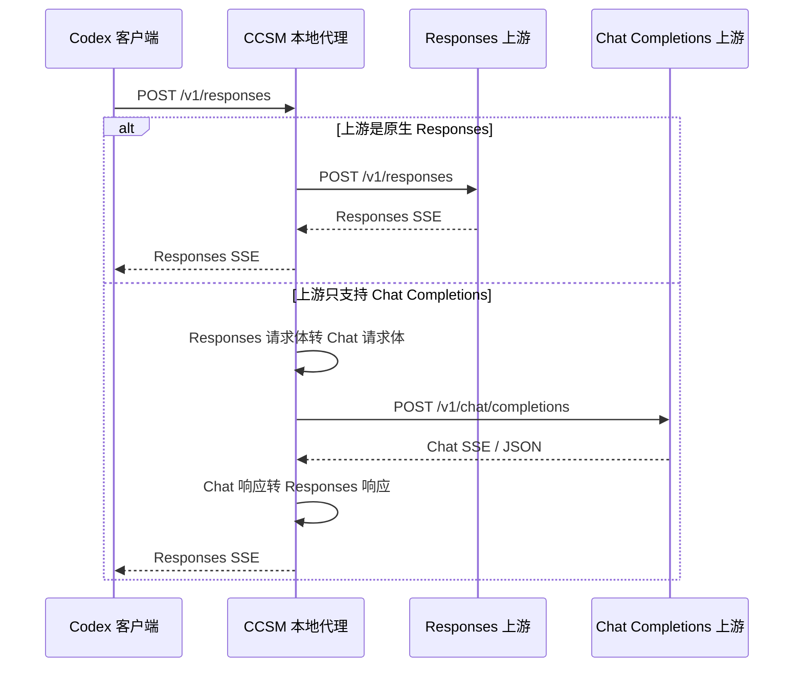
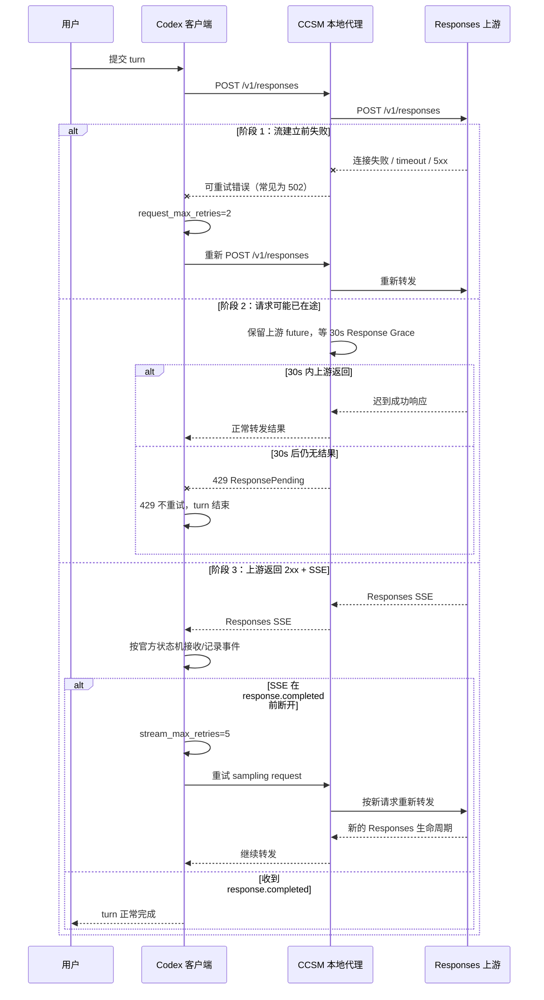
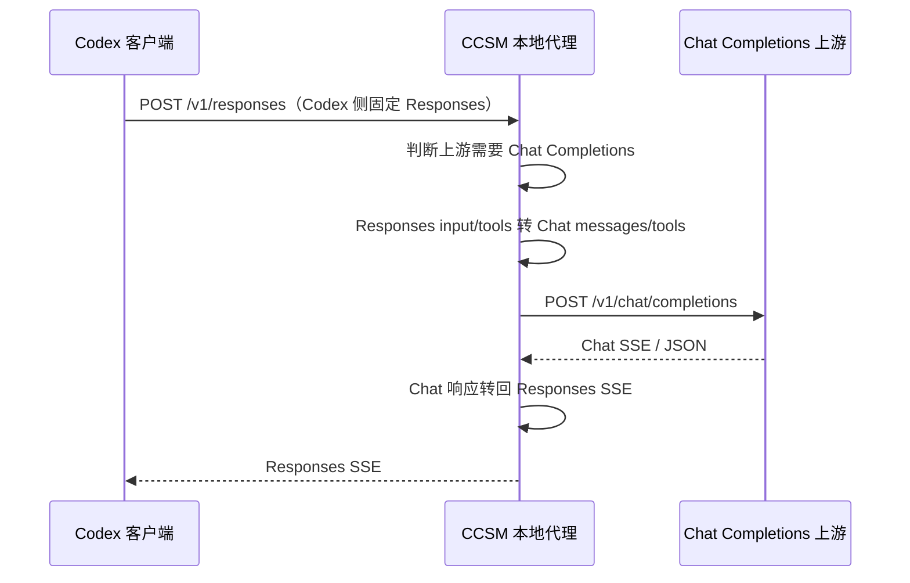
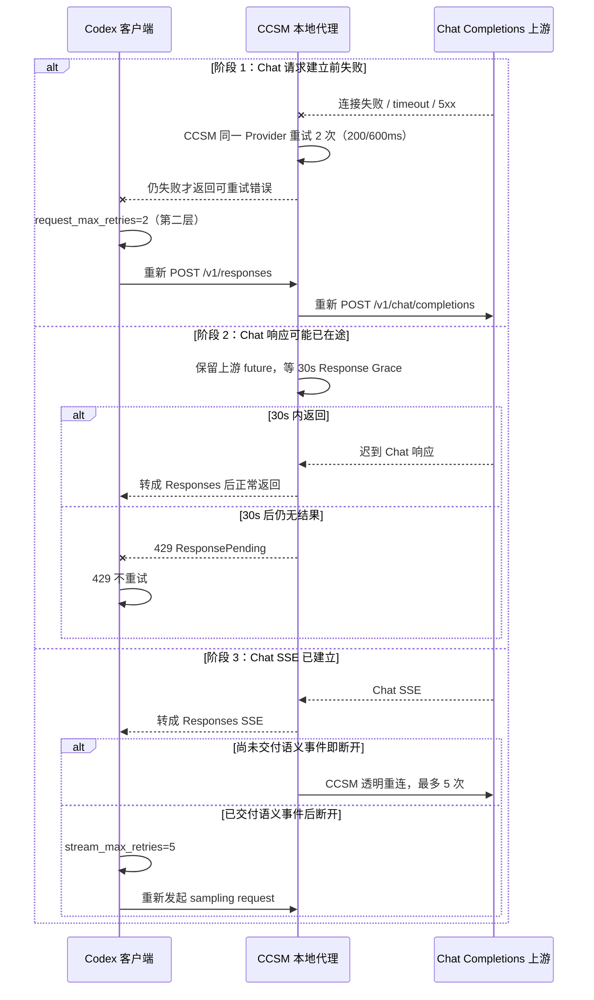

# 更完善的重连机制

> 本文档描述 **Auto Failover 关闭**时的重连机制，不含故障转移队列、熔断器或切换其它 Provider/Route 的行为。这里只说明“同一个 Provider、同一个请求链路”如何尽量恢复。

## 1. 范围与前提

当前 CCSM 托管 Codex Provider 的重试配置是：

| 项目 | 值 | 作用 |
| --- | --- | --- |
| `request_max_retries` | `2` | Codex 在 HTTP 流建立前最多再重试 2 次 |
| `stream_max_retries` | `5` | SSE 在 `response.completed` 前异常中断时，由 Codex 自身最多重试 5 次 sampling request |
| `non_streaming_timeout` | 默认 `600s` | Auto Failover 关闭时作为首个 SSE 字节的硬上限 |
| `streaming_idle_timeout` | 默认 `120s` | SSE 已建立后连续没有数据块的静默超时 |
| Auto Failover | 关闭 | CCSM 只尝试一个 Provider / Route，不切换模型 |
| Response Grace | `30s` | 可能已在途的请求，超时后继续保留上游 future 等 30 秒 |
| CCSM 传输重试 | `2` 次 | 连接/请求构造阶段失败时，代理内同一 Provider 最多再试 2 次（200/600ms） |

重连原则只有一句话：

> **CCSM 只在尚未交付语义事件时透明重连；一旦部分内容进入 Codex，由拥有会话与工具状态的 Codex 自身执行官方流重试。**

## 2. 协议全景

注意：当前 Codex 客户端本身已经统一使用 `/v1/responses` 协议，`wire_api = "chat"` 已不再被 Codex 客户端直接支持。这里说的“Chat 协议 Provider”是指 **Codex 对 CCSM 说 Responses，CCSM 对上游说 Chat Completions**。

## 3. 完整重连时序（Responses 上游）

### 阶段说明

**阶段 1：流建立前失败，CCSM 先做代理内重试。**

Codex 还没拿到 2xx，也没有收到任何 `output_item.done`，此时重新发一次是安全的。CCSM 在发送层对“连接失败 / 请求构造失败 / 发送阶段失败”这类还没收到上游 HTTP 状态的错误，先按 200/600ms 退避重试同一 Provider 最多 2 次；仍失败才返回 502。Codex 的 `request_max_retries=2` 作为第二层兜底，继续用客户端身份重新 POST。

**阶段 2：请求可能已在途，不重发，只等待。**

CCSM 无法确认上游是否已经开始处理，所以不会立刻重发，而是把原来的上游 future 保留下来。常规超时后继续等 30 秒；如果上游结果只是迟到，就正常交付；如果 30 秒后仍没有结果，才返回 429。Codex 对 429 不重试，避免重复执行。

**阶段 3：SSE 已建立，按事件交付边界分层恢复。**

在只收到 `response.created` 或 SSE 注释、尚未向 Codex 交付正文、Reasoning、output item 或工具事件时，CCSM 可以透明重连同一个上游请求，最多 5 次，并抑制重复的 `response.created`。一旦交付任何语义事件，CCSM 永久关闭自身重放通道，因为代理无法撤回已发送字节，也不拥有 Codex 的会话和工具执行状态。

如果此后上游在 `response.completed` 前断开，CCSM 把不完整流交还 Codex。Codex 以 `stream_max_retries=5` 使用自己的 session/turn 状态重试 sampling request；官方源码和测试明确覆盖已经出现 `response.output_item.done` 但缺少 completed 的重试。SSE 长时间静默时，CCSM 还会发送注释心跳，减少本地和客户端 watchdog 把合法长思考误判为死流。

## 4. Chat Completions 上游的完整链路

这条链路的重连规则与 Responses 上游相同，失败分支仍然是：

### Chat 协议的特殊点

1. **转换发生在 CCSM 内。**
   Codex 看到的始终是 `/v1/responses`；只有出站请求被改成 `/v1/chat/completions`。

2. **响应也要转回来。**
   上游返回 Chat SSE 或 JSON，CCSM 会转换成 Responses SSE 再交给 Codex，所以 Codex 的 `response.completed` 语义不变。

3. **响应头不可靠时仍要按请求流标志识别。**
   部分上游不返回 `content-type: text/event-stream`，但 body 实际是 SSE。CCSM 使用“请求 `stream=true` + 非 JSON 响应”作为兜底判断，避免把流式响应整包缓冲后误判成 body 读取失败。

4. **Codex 自身没有单独的 Chat 重连层。**
   因为 Codex 侧永远是 Responses，所以 Chat 上游的恢复仍然由 CCSM 的语义输出前透明重连、Codex `request_max_retries=2`、Response Grace 和 Codex `stream_max_retries=5` 共同决定。

## 5. 关键边界总结

| 故障窗口 | 是否重连 | 谁负责 | 结果 |
| --- | --- | --- | --- |
| 流建立前连接/请求构造失败 | 是 | CCSM 传输重试 2 次 + Codex `request_max_retries=2` | 代理内重发同一请求；仍失败才回退给 Codex |
| 上游可能已在途 | 否，等待 | CCSM `response_grace=30s` | 迟到结果正常交付；否则 429 |
| 429 ResponsePending | 否 | Codex `retry_429=false` | turn 结束，不自动重发 |
| SSE 已建立、尚未交付语义事件 | 是 | CCSM Responses 流包装器，最多 5 次 | 对 Codex 透明，重复 `response.created` 被抑制 |
| 已交付语义事件、未收到 completed | 是 | Codex `stream_max_retries=5` | Codex 使用自身 session/turn 状态重试 sampling request |
| 显式不可重试错误或预算耗尽 | 否 | Codex/CCSM 各自的错误分类器 | turn 明确报错，不无限重试 |

## 6. 为什么由 Codex 负责语义输出后的重试

CCSM 和 Codex 的能力边界不同：

- CCSM 只看到 HTTP/SSE 字节，无法撤回已经交给客户端的 delta，也无法判断工具是否已经执行。
- Codex 拥有 session history、turn 生命周期、item 记录、工具执行状态和 UI 事件，可以在 retry loop 中重新构造 sampling input。
- 当前官方 Codex 默认 `stream_max_retries=5`，其 retry loop 对所有可重试流错误生效，不以“是否已出现语义事件”为禁用条件。
- 官方 `stream_no_completed` 回归测试明确让第一次流产生 `response.output_item.done` 后提前关闭，并断言 Codex 发起第二次请求后正常完成。

因此不能在 CCSM 内简单重放语义流，但也不能把 Codex 自己的重试预算设为 0。正确分层是：代理在语义输出前透明恢复；语义输出后只报告不完整流，由 Codex 官方状态机恢复。

## 7. 相关源码位置

- Codex request retry：`codex-rs/codex-api/src/endpoint/session.rs`
- Codex stream retry：`codex-rs/core/src/session/turn.rs`、`codex-rs/core/src/responses_retry.rs`
- Codex incomplete-stream regression：`codex-rs/core/tests/suite/stream_no_completed.rs`
- Codex 立即持久化 item：`codex-rs/core/src/stream_events_utils.rs`
- CCSM 托管 retry 配置：`cc-switch/src-tauri/src/codex_config.rs`
- CCSM failover 关闭时的超时策略：`cc-switch/src-tauri/src/proxy/handler_context.rs`
- CCSM Response Grace：`cc-switch/src-tauri/src/proxy/response_grace.rs`
- CCSM 同一 Provider 传输重试：`cc-switch/src-tauri/src/proxy/forwarder.rs`
- CCSM 流式响应识别：`cc-switch/src-tauri/src/proxy/response_processor.rs`
- CCSM Responses→Chat 转换：`cc-switch/src-tauri/src/proxy/forwarder.rs`、`cc-switch/src-tauri/src/proxy/providers/codex.rs`
