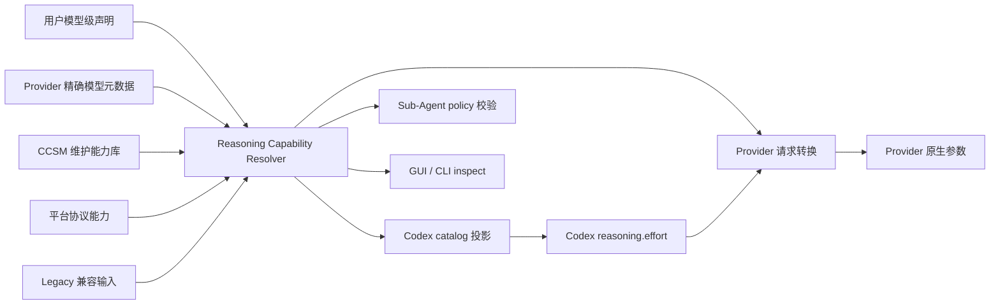
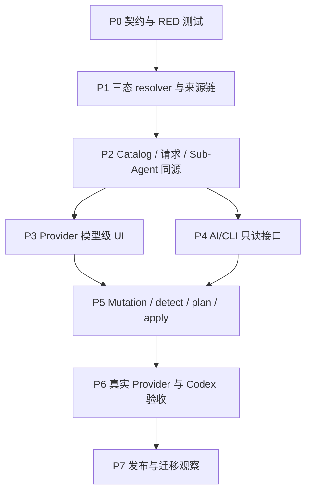

# Codex 第三方模型推理能力修正实施计划

## 1. 目标与边界

本计划把
`docs/superpowers/specs/2026-08-13-codex-preset-reasoning-capabilities-design.md`
推进为可实施、可追踪、可验收的工作包。

目标：Provider、CCSM、Codex、主 Agent 与 Sub-Agent 对同一个最终模型使用同一份推理能力事实，
并让 GUI、CLI 和配置文件通过同一 Application Service 安全修改它。MCP 首版不实施；本地 HTTP
API 仅保留为待定扩展点，不进入本计划交付范围。

本计划不处理 reasoning 内容展示、跨 Provider reasoning 历史回放或 vLLM SSE 事件兼容；这些属于
已有 portable reasoning / replay 设计。这里仅处理“支持什么、用户选什么、最终发送什么”。

## 2. 当前基线

| 能力 | 当前状态 | 本计划动作 |
| --- | --- | --- |
| Rust effort 枚举 | 已含 `none/minimal/low/medium/high/xhigh/max/ultra` | 保留并统一公开 schema |
| 模型 capability | 已有 `CodexModelReasoningCapability`，仍以 `supported: bool` 为主 | 兼容迁移到三态与控制类型 |
| 统一解析结果 | 已有 `ResolvedSubagentReasoningCapability` | 扩展来源、时间、revision、诊断 |
| Codex catalog 投影 | 已接入 resolver，但兼容入口较多 | 完整审计并建立契约快照 |
| 请求转换 | 已有 capability-aware 映射 | 禁止 unknown/none 的隐式厂商转换 |
| Sub-Agent | schema v2 已有四种运行策略 | 收紧 unknown 新配置，隔离 legacy |
| Provider UI | 已有模型级结构化编辑基础 | 增加三态、来源、检测与最终投影 |
| AI/CLI | 尚无正式 reasoning 命令 | 分两阶段加入只读与 mutation |

## 3. 最终数据流



核心门禁：`C`、`T`、`S`、`V` 必须携带同一个 capability fingerprint。任何一层重新按模型名
猜测档位，都视为实现失败。

## 4. 实施路线图



| 阶段 | 可见交付物 | 进入条件 | 完成门禁 |
| --- | --- | --- | --- |
| P0 | schema、fixture、失败测试、能力指纹格式 | 设计批准 | RED 能分别锁定 unknown、空数组、none 和 legacy |
| P1 | 单一 resolver、Provider metadata adapter、维护库 | P0 | 所有来源优先级和失败降级测试通过 |
| P2 | catalog/request/Sub-Agent 同源投影 | P1 | 同一模型四层 fingerprint 一致 |
| P3 | 模型编辑器最终生效视图 | P2 | 用户无需编辑 JSON 即可完成安全配置 |
| P4 | `inspect/list/validate/export` JSON 接口 | P2 | AI 可只读诊断且输出完全脱敏 |
| P5 | `detect/plan/apply/reset` | P3、P4 | dry-run 等价、revision 冲突、回读和幂等通过 |
| P6 | Qwen/vLLM、DeepSeek、OpenAI、unknown canary | P5 | Codex 菜单、请求、Sub-Agent 与上游日志一致 |
| P7 | 迁移报告、release note、回滚说明 | P6 | 安装态验证，不以源码测试代替 |

## 5. 工作包

### P0：冻结契约并先写失败测试

涉及：

- `src/types.ts`
- `src-tauri/src/proxy/providers/codex_reasoning.rs`
- `src-tauri/src/codex_config.rs`
- `src-tauri/src/codex_subagent_profiles.rs`
- 对应 React/Rust 测试

动作：

1. 为“模型推理能力 schema”增加 `schemaVersion`、`supportStatus`、`controlKind`；继续读取旧
   `supported: bool`，新写入只使用新 schema。这里不是 Codex Sub-Agent V1/V2：两套 schema
   必须在代码、错误码、UI 和迁移文案中使用不同名称，禁止都简称为 v1/v2。
2. 明确区分：字段缺失、`unknown`、`confirmed_unsupported`、明确 `supportedEfforts=[]`。
3. 定义稳定 `capabilityFingerprint`：只覆盖影响运行的规范化字段，不包含 `fetchedAt` 等易变元数据。
4. RED 覆盖：unknown 不继承 GPT 档位；空数组不被模板补齐；无关闭契约时 `none` 不变成 false；
   新 fixed 不能借 legacy 通道绕过校验。

### P1：统一来源链和常用模型能力库

建议新增：

- `src-tauri/src/reasoning_capabilities/mod.rs`
- `src-tauri/src/reasoning_capabilities/catalog.rs`
- `src-tauri/src/reasoning_capabilities/provider_metadata.rs`

动作：

1. 将现有 resolver 演进为唯一入口，不在 UI、catalog 或请求转换中增加第二个 switch。
2. Provider Capability Discovery 不局限于 `/v1/models`，按平台适配只读信息源：标准或扩展模型
   元数据、模型详情端点、端点/协议能力、OpenAPI、服务版本以及受信任的服务实例配置摘要。
   OpenRouter 可直接读取 `reasoning.supported_efforts/default_effort/mandatory/supports_max_tokens`；
   vLLM 可组合 `/v1/models`、`/version`、`/server_info?config_format=json` 与 OpenAPI/启动配置，但只
   提取 allowlist 字段，不保存或展示原始服务器路径、凭据和其他敏感配置。
3. Discovery 输出通用 `ProviderCapabilitySnapshot`，可容纳 reasoning、工具调用、结构化输出、输入/
   输出模态、上下文、端点与协议支持；本计划只消费其中 reasoning 子对象，避免以后为其他能力
   重新发明探测框架。
4. adapter 返回 `Found / NotAdvertised / Unavailable / Invalid`，其中后三者均不能自动生成
   `confirmed_unsupported`。禁止通过 low/high/none 真实推理请求主动试错；首版只读取原数据。
5. 维护库使用独立版本化 JSON 资源，禁止编译进 Rust，前端也不得维护副本。它以“平台 + API 格式
   + canonical model + revision range”匹配，并记录来源 URL、核验日期、库版本和证据等级。
6. 第一阶段能力库随应用打包；后续允许用户点击“检查/更新能力库”独立下载签名包，先展示差异、
   验签后原子替换，失败继续使用旧版本。暂不做后台自动更新或运行时在线依赖。
7. 动态读取只进入带 TTL 的候选快照。用户显式配置始终最高优先级；检测到差异时不自动覆盖，而在
   模型行显示小叹号。用户再次进入时展示旧配置、新检测、来源、时间和差异，并提供“采用更新”。
8. 用户采用后产生 `source=user_confirmed_detection` 的覆盖；聚合平台协议声明优先于模型原厂通用
   声明，但仍低于用户模型级覆盖。

### P2：四个消费者改为同源

消费者：

1. Codex JSON catalog / Desktop aliases / inline TOML；
2. Responses → Chat/Anthropic/Provider-native 请求转换；
3. Sub-Agent capability API、profile compiler 和角色 TOML；
4. GUI/CLI inspect 输出。

动作：

- 删除或封闭每个消费者内部的通用 GPT reasoning fallback；
- 每个投影携带 fingerprint 和 source summary；
- catalog 接受的值必须是 `codexSelectableEfforts`；请求转换目标必须在
  `providerAcceptedEfforts`；
- `none` 先按 disable capability 处理，不能作为普通正向 effort 映射；
- MultiRouter 必须在 route model map 后，用 effective Provider + upstream model 解析。

### P3：结构化 UI 与可见诊断

唯一普通入口继续为：

```text
Provider 编辑 → 模型列表 → 编辑模型 → 推理能力
```

模型卡片显示：状态、控制类型、能力来源、核验时间、Provider 原生档位、Codex 可选档位、默认值、
关闭能力、映射和最终行为。unknown 状态默认显示“使用服务端默认”，同时提供：

- 重新检测；
- 采用检测结果；
- 选择维护模板；
- 手动声明；
- 恢复内置值。

首版公共控制词表以 OpenAI/Codex 为基线：

```text
关闭/none、minimal、low、medium、high、xhigh、max、ultra、自定义
```

具体模型只显示其 resolved capability 的子集，不能因为公共词表存在就宣称全部支持。控制类型至少
覆盖 `server_default`、`boolean`、`graded_effort`、`token_budget` 和 `custom`；这样同一能力系统
也能服务其他 Agent，而不是把所有 Provider 强行压成 Codex effort。自定义模式必须声明上游值、
参数路径和到各 Agent adapter 的映射。

主 Agent 设置分成三个不同概念：

1. 模型能力默认值：来自 Provider/能力库，是模型事实；
2. Codex 新任务默认强度：CCSM 可在 Codex 设置页提供快捷配置，写入根级
   `model_reasoning_effort`，只影响之后新建或未持久化选择的任务；
3. 当前任务强度：由 Codex 线程状态持有，CCSM 不从外部强行改写。

若用户切换到不支持当前全局默认的模型，CCSM 必须提示并要求选择目标模型合法值或“模型默认”，
不能静默钳制。Provider 模型编辑页可以跳转到 Codex 默认设置，但不能把能力默认与用户默认混为一项。

Sub-Agent V2 页面只消费后端 resolved 结果，并显示最终控制来源。新 profile 默认
`delegated`；unknown 新建 `fixed` 前必须先完成模型能力声明。CCSM 可以配置 Codex 的
`[agents].default_subagent_reasoning_effort`，但这是单个全局 spawn 默认值，只有在所有可选目标模型
均支持时才允许写入。单次 `spawn_agent.reasoning_effort` 是父 Agent 在运行时决定的调用参数，
不是 CCSM 预先写死的配置；CCSM 不改写 reserved spawn schema。

Sub-Agent V1 继续可读取、运行、导出和迁移，但本轮新的模型能力编辑与固定 effort 写入优先落在
V2；V1 不新增一套 reasoning 配置逻辑，也不删除用户现有数据。

### P4：AI/CLI 只读面

先交付无风险查询：

```text
ccsm reasoning list
ccsm reasoning inspect --provider <id> --model <id> --output json
ccsm reasoning validate --provider <id> --output json
ccsm reasoning export --provider <id> --redacted --output json
```

CLI 可执行文件暂定 `ccsm`，产品名称显示为 `CCSwitchMulti CLI`；默认输出版本化 JSON，而不是
人类文本。响应统一包含：`schemaVersion/requestId/revision/persisted/resolved/codexProjection/
providerProjection/diagnostics`。stdout 只放数据，stderr 放诊断；密钥和 reasoning 正文永不输出。
可选 `--human` 仅用于交互阅读，不作为稳定机器契约。权威导入格式为 JSON + JSON Schema，YAML
只作为可选输入，解析后必须进入同一 JSON 数据模型。

### P5：AI/CLI 写入面

```text
ccsm reasoning detect --provider <id> --model <id>
ccsm reasoning plan --file <declaration.json>
ccsm reasoning apply --file <declaration.json> --expected-revision <n>
ccsm reasoning reset --provider <id> --model <id> --expected-revision <n>
```

必须满足：

- `detect` 默认零持久化副作用；
- `plan` 和 `apply` 调用同一校验与规范化函数；
- 写入使用乐观并发与幂等目标状态；
- mutation 完成数据库写入、派生产物刷新、文件回读和 resolver 回读后才返回成功；
- 失败恢复原声明与派生产物，并返回不含敏感数据的 rollback 结果；
- AI 无权把无证据猜测标记为 Provider authoritative，手工声明固定为 `source=user`。
- 写操作必须有人确认；非交互自动化至少携带前一次 plan 返回的 `planToken`、
  `expectedRevision` 和显式确认标志。
- 允许 AI 直接写入 API key 等密钥，但必须通过 JSON/stdin 或安全 secret input 进入 mutation；密钥
  不得出现在命令行参数、stdout、stderr、审计日志或回读对象中。成功只返回 `hasSecret`、指纹或
  脱敏摘要，仍禁止 AI 读取现有密钥明文。

### P6：真实验收矩阵

| 场景 | Catalog/UI | Codex 请求 | Provider 上游 | Sub-Agent |
| --- | --- | --- | --- | --- |
| Qwen/vLLM 无档位元数据 | unknown、无虚假菜单 | 不注入 effort | 不把 none 转 false | delegated 可运行 |
| Qwen/vLLM 用户确认 low/high | 只显示 low/high | 只接受 low/high | 按声明字段映射 | fixed high 可运行 |
| DeepSeek 维护能力 | low/high/max，默认 high | 合法别名才可选 | 显式映射到原生值 | 四策略逐项验证 |
| OpenAI 官方模型 | 官方 catalog | 原生 Responses | 不经第三方翻译 | 目标模型集合校验 |
| unknown 自定义网关 | 服务端默认 | 省略 effort | 不猜测 | fixed 被阻止并引导声明 |

每个场景保存同一 trace 的：resolved fingerprint、Codex model list、实际请求 JSON 的脱敏结构、
Provider 接收结果、角色 TOML 和子任务最终 effort。不得只凭 UI 截图或单元测试验收。

### P7：迁移、发布与回滚

1. 模型推理能力旧 `supported` 与 `codexChatReasoning` 按“读旧写新”迁移，不长期双写冲突字段。
2. Sub-Agent V2 作为新能力的主要读写路径；V1 保留兼容读取、运行、导出与迁移入口。
3. unknown + legacy fixed 保留两个稳定版本并显示警告；重新保存时要求建立能力声明或改为 delegated。
4. 首次升级生成迁移报告，不把 legacy 推断固化为 authoritative。
5. 先发布 read-only/diagnostic，再开放 mutation；mutation 可由 feature flag 分阶段启用。
6. release acceptance 必须覆盖安装版、运行中的 15721、Codex app-server 重启和新任务。
7. 回滚保留旧 schema 字段读取能力；新 schema 在旧版不可安全读取时，升级前生成可恢复备份。

## 6. 提交与验收节奏

每个阶段至少拆成 RED、GREEN、集成/文档三个独立提交。每个提交只承担一个可验证结论，说明根因、
测试和影响范围，并以仓库要求的署名结尾。P0 至 P5 不改版本号；只有 P6 安装验收通过后才进入
release 决策。

## 7. 已确认决策

1. 用户显式模型配置最高优先级；新检测只提示差异，由用户采用。
2. 能力库为独立版本化 JSON，不编译进 Rust；未来支持用户主动下载签名更新包。
3. 首版只读元数据，不用 low/high/none 真实请求主动试探。
4. 公共词表贴近 Codex 并扩展：none/minimal/low/medium/high/xhigh/max/ultra/custom；模型只显示子集，
   同时支持 boolean、budget 和 server-default。
5. CCSM 提供 Codex 新任务默认强度设置，不强改当前线程。
6. Sub-Agent V2 新 profile 默认 delegated；允许安全配置全局 subagent default，但单次 spawn 参数由
   父 Agent 运行时决定。
7. legacy unknown + fixed 保留两个稳定版本的迁移窗口。
8. 模型能力 schema 读旧写新；Sub-Agent V2 优先，V1 兼容只读/运行/导出/迁移。
9. CLI 暂定 `ccsm`，默认 JSON；写入需要确认；允许 AI 通过安全输入直接写密钥但禁止回读明文。
10. 首版不做 MCP；本地 HTTP API 保留为 TBD，不进入当前实现。
11. JSON 为权威配置格式，YAML 为可选输入。
12. 审计默认保留 180 天或 10,000 条 mutation；不记录敏感值或 reasoning 正文。
13. 能力库未来可独立更新、允许社区 PR，所有非恒等映射保存前必须可见。

## 8. 仍需技术调研但不需要产品拍板

1. 各 Provider 首批可用的只读能力端点及字段可信度；优先完成 OpenRouter 与 vLLM adapter 证据矩阵。
2. vLLM `/server_info` 在不同版本、部署参数和鉴权模式下的可用性，以及安全 allowlist。
3. Qwen 各模型/后端对 boolean、thinking budget 和 graded effort 的真实支持差异。
4. 非 Codex Agent 的 effort/budget/boolean 适配表和能力投影命名。
5. 模型 alias、日期版本、revision 与 canonical ID 的稳定归一化规则。

这些调研只能改变维护库和 adapter 证据，不能推翻 unknown fail-closed、用户最高优先级或禁止主动
推理试探等已确认原则。

## 9. 本轮证据更新

- OpenAI 官方模型并不共享统一子集：GPT-5.6 当前公开集合是
  `none/low/medium/high/xhigh/max`，而 Codex 内部还存在 `minimal/ultra/custom` 等表达。因此公共词表
  可以取并集，但每个模型必须以 catalog 子集为准：
  <https://developers.openai.com/api/docs/guides/latest-model>
- OpenRouter `GET /api/v1/models` 的模型对象包含 `supported_parameters`，当前 reasoning 文档进一步
  定义了逐模型 `reasoning.supported_efforts/default_effort/default_enabled/supports_max_tokens/
  mandatory`，证明平台 adapter 可以在不发送推理请求的情况下获得分档、默认、预算和强制开启信息：
  <https://openrouter.ai/docs/guides/best-practices/reasoning-tokens>
- vLLM 官方服务暴露 `/v1/models`、`/version`，当前 API 还提供
  `/server_info?config_format=json`；`vllm serve` 存在 `reasoning-config`、reasoning parser 等启动配置。
  这些字段能够证明服务实例配置，但官方证据尚不能证明它们完整表达模型的所有可选 effort，因此
  只能作为多源 snapshot，缺失仍是 unknown：
  <https://docs.vllm.ai/en/latest/serving/online_serving/>
  <https://docs.vllm.ai/en/latest/cli/serve/>
- Qwen 官方文档区分 hard thinking switch 与 thinking budget，并明确部分 budget 能力依赖具体服务
  实现。这支持 boolean、budget、graded effort 分开建模，而不是把所有 Qwen 写成统一档位：
  <https://qwen.readthedocs.io/en/stable/getting_started/quickstart.html>
