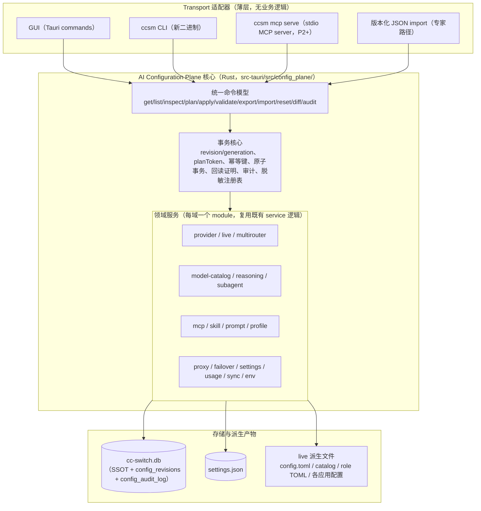

# CCSwitchMulti 全面 AI 可配置接口（AI Configuration Plane）设计

## 0. 文档状态与范围

- 状态：设计评审稿。本轮只做研究与设计，不实施生产代码。
- 日期：2026-08-17。
- 前置文档：
  - `docs/superpowers/specs/2026-08-13-codex-preset-reasoning-capabilities-design.md`（reasoning 领域契约，第 9 节明确把全局配置平面留给独立设计文档，即本文档）；
  - `docs/superpowers/plans/2026-08-17-codex-reasoning-capability-correction.md`（reasoning 修正路线图，其中 P4/P5 的 AI/CLI 契约是本文档在 reasoning 领域的实例化）。
- 与既有决策的关系：reasoning 设计在 2026-08-17 确认的“首版不做 MCP；本地 HTTP API 保留 TBD”是**reasoning 领域首版**的范围决策。本文档是全局设计，结论是：MCP 作为一等 transport 纳入分期计划（只读先行、mutation 后置），本地 HTTP API 保留为可选扩展点、默认关闭。这不推翻 reasoning 首版范围，而是把 MCP 的引入推迟到全局平面的 P2/P3 阶段，与 reasoning 的 P4/P5 节奏对齐。
- 2026-08-16 曾有一次全局配置平面研究任务因响应流中断未完成，只留下“配置域、写入路径、SSOT、敏感边界”的可验证盘点结论（见 `memory.md` 2026-08-16/2026-08-17 条目）。本文档在该盘点基础上重新做了完整源码审计，不引用任何未提交草稿。

## 1. 目标与非目标

### 1.1 目标

1. 让 AI Agent、CLI 脚本和高级用户能够**安全、稳定、可审计**地读取、规划、修改并验证 CCSwitchMulti（CCSM）的全部重要配置。
2. GUI、CLI、导入文件和未来 MCP/API 复用**同一后端领域服务与事务**，不形成多套逻辑；任何 transport 不得自带推断规则。
3. 稳定版本化 schema、capabilities/discovery、统一命令模型（get/list/inspect/plan/apply/validate/export/import/reset/diff）、默认 JSON 输出、稳定错误码与退出码、stdin/body-file 输入、dry-run、revision 乐观并发、幂等键、原子事务、回读证明、审计日志、脱敏、权限范围、备份与 rollback。
4. 明确哪些配置可公开配置、哪些是内部派生状态、哪些是敏感凭据、哪些不可开放；禁止把直接改 SQLite、生成的 `config.toml`、model catalog 或角色 TOML 作为推荐自动化接口。

### 1.2 非目标

- 不改变 Codex/Claude 等下游应用自身的配置语义；CCSM 只管理自己拥有（owned）的配置单元。
- 不做远程多用户协作配置；多设备同步（WebDAV/S3）维持现有“整库快照”模型，只被纳入审计与冲突可见性。
- 不实现 Codex 会话历史、用量统计的写入接口（只读查询除外）。
- 不引入云端服务；一切接口都是本机接口。
- 本轮不写生产代码；实施计划见第 10 节。

## 2. 现状盘点

### 2.1 持久化层与单一事实源（SSOT）

源码审计（`src-tauri/src/database/schema.rs`、`settings.rs`、`app_config.rs`、`config.rs`）确认 CCSM 当前有四个持久化层：

| 层 | 位置 | 内容 | SSOT 判定 |
| --- | --- | --- | --- |
| SQLite 数据库 | `~/.cc-switch/cc-switch.db` | `providers`、`provider_endpoints`、`mcp_servers`、`prompts`、`skills`、`skill_repos`、`settings`(KV)、`proxy_config`(每应用一行)、`provider_health`、`proxy_request_logs`、`model_pricing`、`stream_check_logs`、`proxy_live_backup`、`usage_daily_rollups`、`session_log_sync`、`quota_collaboration_reports`、`profiles` | **持久化配置的主 SSOT** |
| 设备级设置文件 | `~/.cc-switch/settings.json` | `AppSettings`：托盘/自启/静默启动、每应用 config dir 覆盖、每应用 current provider、skill 同步方式、WebDAV/S3 同步凭据、备份策略、终端偏好、quota 协作、本地迁移标记 | 设备级设置的 SSOT（不随数据库同步） |
| 旧版多应用配置 | `~/.cc-switch/config.json`（`MultiAppConfig` v2） | 历史 provider/MCP/prompt/skill 存储 | **遗留层**：首启时一次性迁移进 DB，运行时只读校验，不再是写入口 |
| Live 派生文件 | `~/.codex/config.toml`、`~/.codex/auth.json`、`~/.codex/cc-switch-model-catalog.json`、`~/.codex/agents/*.toml`、`~/.claude/settings.json`、Claude Desktop 配置、Gemini/Grok/OpenCode/OpenClaw/Hermes 各自配置、各应用 MCP 配置、prompt 文件、skill 符号链接/拷贝 | 由 DB 状态生成 | **派生产物**：必须可从 DB 重建；但会被外部写者（Codex Desktop、用户手改）修改，存在漂移 |

关键事实：

- `providers.settings_config` 是**无 schema 约束的 JSON blob**（`src/types.ts` 中 `settingsConfig: Record<string, any>`），领域语义由 app_type 特定代码解释。这是“配置域”边界模糊的根源，也是统一 schema 必须解决的问题。
- Sub-Agent V2 配置存在 provider 的 `settings_config.codexRouting.subagentV2` 内（`src-tauri/src/services/provider/mod.rs` 测试与 `src-tauri/src/codex_subagent_profiles.rs` 证实），不是独立表。
- 外部 OpenAI API 服务已有一个正确的密钥处理先例：`ExternalOpenAiApiProfile` 只存 `api_key_hash`/`api_key_prefix`，视图层返回 `has_api_key`（`src-tauri/src/proxy/external_openai_api.rs`）。
- `get_settings_for_frontend()` 已经对 WebDAV password、S3 secret 做清空（`settings.rs`），说明“前端视图脱敏”已有局部实践，但没有统一注册表。

### 2.2 可配置领域清单

按“用户可公开配置 / 内部派生状态 / 敏感凭据 / 不可开放”四类划分。领域 ID 是后续命令树与 MCP 工具命名使用的稳定标识。

#### A. 用户可公开配置（read + plan + apply）

| 领域 ID | 内容 | 主要存储 | 源码证据 |
| --- | --- | --- | --- |
| `provider` | 每应用 Provider CRUD、排序、备注、图标、分类、custom endpoints、universal provider（跨应用同步） | `providers`、`provider_endpoints` | `commands/provider.rs`、`services/provider/mod.rs` |
| `live` | 每应用当前 Provider、live 同步、live takeover 开关、官方 Provider 恢复 | `settings.current_provider_*`、`providers.is_current`、`proxy_config.live_takeover_active` | `ProviderService::switch`、`live.rs` |
| `multirouter` | Codex MultiRouter 路由、route model map、聚合目录、账号池策略、model picker 解锁 | provider `settings_config`（routes）、`proxy_config`、`codex_oauth_auth` 账号池 | `services/proxy.rs`、`proxy/providers/codex.rs` |
| `model-catalog` | 模型目录条目、模型定价、models.dev 同步配置 | provider `modelCatalog`、`model_pricing` | `codex_config.rs`、`commands/misc.rs` |
| `reasoning` | 模型级推理能力声明、Codex 新任务默认 effort、全局 subagent 默认 effort | `modelCatalog.models[].reasoning`、common config | 见 reasoning 设计文档 |
| `subagent` | Sub-Agent V1/V2 profile、运行策略（delegated/model_default/fixed/disabled）、选择策略 | provider `settings_config.codexRouting.subagentV2` | `codex_subagent_profiles.rs` |
| `mcp` | MCP server 统一目录、每应用启用开关 | `mcp_servers` | `services/mcp.rs`、`mcp/*.rs` |
| `skill` | skill 安装/卸载/更新、skill repos、每应用启用、存储位置 | `skills`、`skill_repos`、`settings.json` | `services/skill.rs` |
| `prompt` | prompt CRUD、每应用启用 | `prompts` | `services/prompt.rs`、`prompt_files.rs` |
| `proxy` | 每应用代理配置（监听、超时、熔断、重试、日志）、全局上游代理、外部 OpenAI API profile | `proxy_config`、`settings.json`、`external_openai_api` | `commands/proxy.rs`、`commands/global_proxy.rs` |
| `failover` | 故障转移队列、自动故障转移、熔断器配置与重置 | `providers.in_failover_queue`、`provider_health`、`proxy_config` | `commands/failover.rs` |
| `settings` | 设备级 AppSettings（托盘、自启、目录覆盖、终端、备份策略、语言等） | `settings.json` | `settings.rs` |
| `profile` | 项目 profile（跨应用 provider/mcp/skill/prompt 槽位快照） | `profiles` | `services/profile.rs` |
| `usage` | 用量查询脚本、自动查询间隔、stream check 配置 | provider `settings_config`、`stream_check_logs` 配置 | `services/coding_plan.rs`、`commands/stream_check.rs` |
| `sync` | WebDAV/S3 同步设置与手动同步操作 | `settings.json`（凭据）、`sync_protocol.rs` | `commands/webdav_sync.rs`、`commands/s3_sync.rs` |
| `env` | 环境变量冲突检查/删除/恢复（带备份） | 系统环境 + 备份文件 | `services/env_manager.rs` |

#### B. 内部派生状态（只读 inspect，不可直接写）

| 项 | 说明 |
| --- | --- |
| live 文件内容（`config.toml`、catalog、role TOML、各应用 live 配置） | 由 DB 派生；`inspect` 返回内容与漂移检测，写入只能通过对应领域的 apply 触发重建 |
| `provider_health`、熔断器状态 | 运行时状态，可 `reset`（熔断器）但不可任意写 |
| `proxy_live_backup` | live 接管前的备份，restore 是受控操作 |
| 代理运行状态（15721/15722 等） | 运行时事实，`inspect` 只读；start/stop 是受控操作 |
| 账号池运行态（affinity、凭据代际） | 运行时状态，只读 |

#### C. 敏感凭据（write-only 或生命周期操作，禁止回读明文）

| 项 | 处理 |
| --- | --- |
| Provider API key（`settings_config` 内） | 可通过安全输入写入（CLI stdin/file、GUI 输入框）；任何输出只返回 `hasSecret`/前缀/哈希 |
| Codex OAuth / Copilot / xAI OAuth 托管账号 | 只开放生命周期操作（login/logout/remove/set-default）与状态查询；token 永不回读 |
| WebDAV password、S3 secret access key | 同 API key 处理；`get_settings_for_frontend` 已有清空先例 |
| 外部 OpenAI API key | 已有 hash+prefix 先例，纳入统一脱敏注册表 |
| 用量脚本中的 apiKey/accessToken/secretAccessKey | 同 API key 处理 |

#### D. 不可开放项

| 项 | 理由 |
| --- | --- |
| 直接 SQL 导入/导出（`import_config_from_file`/`export_config_to_file`） | 原始 SQL dump 无 schema 校验，是最大漂移源；AI 面禁止，GUI 保留为专家路径并加显式警告，长期由版本化 JSON import/export 替代 |
| 数据库文件直接访问 | 禁止作为接口；备份/恢复走受控操作 |
| 更新器内部（`check_app_update`/`install_update_and_restart`） | 应用自更新不属于配置域；CLI 只暴露只读版本信息 |
| OpenClaw workspace 文件读写（`read/write_workspace_file`、daily memory） | 属于用户数据而非 CCSM 配置，不纳入配置平面 |
| Codex 会话历史修复/迁移 | 属于数据修复域，保留现有专用命令，不并入配置平面 |
| 托盘/窗口主题等纯 UI 运行时状态 | 无持久化语义，不开放 |

### 2.3 写入路径清单与多写者漂移

源码审计确认的**全部**写入路径（按写者归类）：

1. **GUI → Tauri commands → services → DB + live 文件**（主路径，约 250 个 command，`lib.rs` invoke_handler 清单）。
2. **Deep link**（`ccswitch://`）：`parse_deeplink` → `import_from_deeplink(_unified)`，外部 URL 直接写 DB 并触发 live 同步（`deeplink/provider.rs` 44KB 的合并逻辑）。
3. **SQL 导入**：`import_config_from_file` → `db.import_sql`，整库替换，无 schema 校验，随后 `run_post_import_sync`。
4. **WebDAV/S3 同步下载**：`sync_protocol.rs` 定义 `db.sql` + `skills.zip` + `manifest.json` 整库快照协议，下载即整库替换。
5. **DB 备份恢复**：`restore_db_backup` 整库替换。
6. **live 文件反向导入**：`import_opencode_providers_from_live`、`import_openclaw_providers_from_live`、`import_hermes_providers_from_live`、`import_mcp_from_apps`、`import_skills_from_apps`——从 live 文件读回 DB。
7. **live 同步**：`switch_provider`、`sync_current_to_live`、启动对账（`reapply_current_codex_official_live`、catalog 对账）——DB → live 文件。
8. **代理运行时**：takeover 时改写 live 配置（`proxy_config.live_takeover_active`）、账号池 reproject（`reproject_current_codex_multirouter_for_pool_policy`）。
9. **外部写者**：Codex Desktop 自身会写 `~/.codex/config.toml`（notify 路径、developer_instructions 等，memory 2026-08-16 已记录根修）；用户手工编辑 live 文件。
10. **系统环境变量**：与配置冲突，`env_manager` 提供检查/删除/恢复。
11. **CLI**：当前只有 `codex-history-repairer` 一个专用二进制（`src-tauri/src/bin/`），**没有通用配置 CLI**。

漂移风险结论（与 2026-08-16 中断任务的有效结论一致，并经本轮源码复核）：

- GUI、deep link、SQL 导入、同步下载、备份恢复、live 反向导入、代理运行时、外部写者共 **8 类写者**，其中 5 类（deep link、SQL 导入、同步、备份恢复、live 反向导入）绕过统一的校验/事务/审计。
- live 文件既是派生产物又是被读回的输入（反向导入），形成“派生物污染 SSOT”的回路。
- 没有任何跨写者的 revision/并发控制；两个写者并发时后写者静默覆盖。
- 没有任何统一审计日志；`proxy_request_logs` 只记录请求，不记录配置变更。

### 2.4 敏感数据边界

- 禁止在任何接口输出、日志、审计、回读中出现：API key 明文、OAuth token、Cookie、WebDAV/S3 凭据、用量脚本密钥。
- 允许：`hasSecret: true`、前缀（如 `sk-…` 前 4 位 + 长度）、SHA-256 指纹（用于幂等与变更检测）。
- 写入密钥的唯一合法通道：CLI stdin/`--file`（文件权限 0600）、GUI 输入控件、未来 MCP 的 URL-mode elicitation（带外）。MCP form mode 按官方规范**禁止**收集敏感信息（见第 7 节引用）。

## 3. 总体架构

### 3.1 分层：领域服务 / 事务核心 / transport 适配器



硬性规则：

1. **单一 mutation 入口**：所有 transport 的写操作必须调用领域服务的 mutation 函数；transport 层禁止直接执行 SQL、禁止直接写 live 文件、禁止自带校验或推断规则。
2. **既有 service 逻辑下沉复用**：`ProviderService`、`McpService`、`ProfileService`、`codex_subagent_profiles` 等现有实现是领域服务的主体，配置平面是它们的**事务与契约外壳**，不是重写。重构方向是把现有 Tauri command 里的“取 State → 调 service → 拼 JSON”拆成“command → config_plane 领域服务”，service 内部逻辑保持。
3. **派生产物只由核心重建**：live 文件写入统一走 `derive/` 模块（现有 `write_live_snapshot`、`write_codex_live_atomic`、`mcp/*.rs` 等收敛为 derive 后端），任何领域 apply 成功后由核心统一触发受影响派生产物的重建与回读。
4. **读路径同源**：`inspect` 返回的 persisted/resolved/projection 四层数据必须与 GUI 使用的后端结果来自同一函数（与 reasoning 设计的 fingerprint 门禁一致）。

### 3.2 单写者原则与跨进程协调

- **进程内**：核心持有一把全局 mutation 锁（`Mutex`），串行化所有写事务。
- **跨进程**（GUI 与 CLI/MCP 并发）：
  - SQLite 使用 WAL + `busy_timeout`，保证读不阻塞、写有锁；
  - 额外引入文件锁 `~/.cc-switch/.config-plane.lock`（独占锁，仅 mutation 持有），防止 SQLite 锁超时下的写交错；
  - 每次成功 mutation 递增全局 `config_generation`（存 `settings` KV 或独立表），并写 `~/.cc-switch/.config-plane-event`（含 generation、时间戳、领域、资源、actor）；
  - GUI 应用轮询/监听 generation 变化（建议 2s 轮询 + 文件事件），变化时重载受影响状态并在 UI 提示“配置已被外部修改”；
  - 现有“整库替换”路径（备份恢复、同步下载）完成后同样必须 bump generation 并触发重载，纳入同一机制。
- **运行时操作**（代理 start/stop、takeover、账号池、需要运行中代理的对账）：CLI/MCP 通过应用启动时写入的 `~/.cc-switch/runtime.json`（loopback 地址 + 每次启动随机 token）发现运行中的应用，经 loopback JSON-RPC 转发；应用未运行时返回稳定错误 `app_not_running`，不得退化为直接改 live 文件。

### 3.3 revision 与 generation

- **资源级 revision**：新表 `config_revisions(domain TEXT, resource_key TEXT, revision INTEGER, updated_at TEXT, PRIMARY KEY(domain, resource_key))`。每个可写资源（provider、mcp server、proxy 行、settings 组等）一个单调递增 revision；mutation 成功后 +1。
- **全局 generation**：跨资源单调递增，用于跨进程失效通知与 `diff` 基线。
- **乐观并发**：`apply` 必须携带 `expectedRevision`（资源级）；不匹配返回 `revision_conflict`，附当前 revision 与当前状态摘要（脱敏），由调用方重新 `inspect` 后重试。
- **兼容策略**：revision 表缺失（旧库）时首次 mutation 前做一次性初始化（按现有 `updated_at`/内容哈希播种），读操作不依赖 revision 存在。

## 4. 版本化 Schema 与 Discovery

### 4.1 公开 schema 约定

1. **权威格式是 JSON + JSON Schema**（与 reasoning 设计决策一致）；YAML 只作为可选输入，解析后必须进入同一 JSON 数据模型。
2. 每个公开声明文件（plan/apply/import 的输入）使用独立、版本化的 schema，**不暴露数据库行结构**：

```json
{
  "schemaVersion": 1,
  "kind": "ccsm.provider.spec",
  "resource": { "appType": "codex", "id": "my-vllm" },
  "spec": { }
}
```

   - `kind` 命名空间固定为 `ccsm.<domain>.<resource-kind>`，例如 `ccsm.provider.spec`、`ccsm.reasoning-capability.spec`、`ccsm.multirouter.routes.spec`、`ccsm.mcp.server.spec`、`ccsm.subagent.profile.spec`、`ccsm.proxy.app-config.spec`。
   - `schemaVersion` 是整数，只增不减；读旧写新：新版本必须能读旧版本声明，新写入只用当前版本。
   - 每个 kind 的 JSON Schema 随应用打包（`src-tauri/src/config_plane/schemas/`），`ccsm schema <kind>` 可导出；MCP 的 `inputSchema`/`outputSchema` 从同一份 schema 生成，禁止手写第二份。
3. **输出 schema**：所有命令输出是版本化 JSON 对象，统一信封：

```json
{
  "apiVersion": 1,
  "schemaVersion": 1,
  "requestId": "req_01J...",
  "ok": true,
  "data": { },
  "diagnostics": { "warnings": [], "errors": [] }
}
```

   - stdout 在机器模式只输出该 JSON；诊断/进度写 stderr；`--human` 仅交互阅读，不是稳定契约。
   - 错误时 `ok=false`，`data.error` 携带稳定错误码（第 5.4 节），退出码与错误码映射固定。
4. **capabilities/discovery**：`ccsm capabilities`（及 MCP `ccsm_capabilities` 工具）返回：

```json
{
  "apiVersion": 1,
  "appVersion": "3.19.x",
  "domains": [
    {
      "id": "provider",
      "title": "Provider 管理",
      "operations": ["list", "get", "inspect", "plan", "apply", "validate", "export", "reset"],
      "kinds": ["ccsm.provider.spec"],
      "schemaVersions": { "ccsm.provider.spec": [1] },
      "riskLevel": "standard",
      "requiresAppRunning": false
    }
  ],
  "limits": { "maxSpecBytes": 1048576, "planTtlSeconds": 900 }
}
```

   - `riskLevel`：`read` / `standard` / `destructive`（reset、delete、backup restore、import）/ `runtime`（需要运行中应用）。
   - `requiresAppRunning`：声明该域操作是否依赖运行中的应用（代理运行时操作）。
   - 未实现/未启用的域不出现在 capabilities 中（feature flag 控制），避免 AI 调用不存在的操作。

### 4.2 稳定标识

- 资源键（`resource_key`）规则：`provider` 为 `<appType>/<id>`；`mcp` 为 `mcp/<id>`；`proxy` 为 `proxy/<appType>`；`settings` 为 `settings/<group>`；`subagent` 为 `subagent/<providerId>/<profileId>`；`reasoning` 为 `reasoning/<providerId>/<modelId>`。
- 所有 ID 在输出中保持稳定；禁止把数组下标（如 `codex-N`）作为公开 ID（与 reasoning 设计对 `presetKey` 的要求一致）。

## 5. 命令模型

### 5.1 操作集

每个域按能力暴露以下操作（不是每个域都有全部操作）：

| 操作 | 语义 | 风险级 | 副作用 |
| --- | --- | --- | --- |
| `list` | 列出资源摘要（id、名称、revision、状态标志） | read | 无 |
| `get` | 读取单个资源的 persisted 声明（脱敏） | read | 无 |
| `inspect` | 四层视图：persisted / resolved / projection（派生产物摘要）/ diagnostics（来源、漂移、警告） | read | 无（reasoning 的 detect 除外，见 9.1） |
| `validate` | 对现有状态或给定 spec 执行 schema + 语义校验，不写 | read | 无 |
| `plan` | 对 spec 执行与 apply **完全相同**的校验与规范化，计算差异，返回 `planToken`，不写 | read | 无（只缓存 plan） |
| `apply` | 原子执行 mutation：DB 写 + 派生产物重建 + 回读证明 | standard/destructive | 有 |
| `export` | 导出资源或整域为版本化 JSON（默认脱敏，`--include-secrets` 仅限本地文件且需显式确认） | read | 无 |
| `import` | 从版本化 JSON 导入（专家路径；等价于批量 plan+apply，逐资源事务） | destructive | 有 |
| `reset` | 把资源恢复到内置默认/出厂状态（保留用户数据备份引用） | destructive | 有 |
| `diff` | 两个 generation/revision 之间、或 spec 与当前状态之间的差异 | read | 无 |
| `audit` | 查询审计日志（全局操作，非域操作） | read | 无 |

### 5.2 plan/apply 语义

1. **plan**：
   - 输入 spec（`--file` 或 stdin），执行 schema 校验 → 语义校验（领域规则）→ 规范化 → 与当前状态计算差异；
   - 输出：`diff`（逐字段 before/after，脱敏）、`warnings`、`planToken`、`expectedRevision`（当前值，供 apply 引用）、`expiresAt`；
   - `planToken` 是不透明高熵字符串（≥128 bit 随机），TTL 默认 900s，**绑定**（spec 规范化哈希 + 资源键 + 当前 revision），单次使用；
   - `--dry-run` 是 `plan` 的别名，语义完全一致。
2. **apply**：
   - 输入：spec + `--expected-revision <n>`（必须）+ 非交互场景的 `--plan-token <t>`（必须）+ 交互场景的确认；
   - 校验链与 plan 完全相同（同一函数），然后：
     a. 获取跨进程文件锁 + 进程内 mutation 锁；
     b. 复核 `expectedRevision` 与 planToken（若提供）；
     c. SQLite 事务内写 DB + 更新 `config_revisions`；
     d. 事务提交后重建受影响派生产物（原子写：临时文件 + rename，沿用现有 `write_*_atomic` 模式）；
     e. **回读证明**：重读 DB 行、重跑 resolver、逐文件比对派生产物内容（与 Sub-Agent V2 现有 `roleFilesStatus=verified` 模式一致）；
     f. 写审计日志、bump generation、写事件文件；
     g. 释放锁，返回结果。
   - 任一步失败：DB 事务回滚；已写派生产物从 mutation 前快照恢复；返回 `rollback` 结果（不含敏感数据）；审计记录 `failed` 与原因。
3. **幂等**：apply 的目标状态与当前状态规范化后相等时，返回 `changed: false`、revision 不变、不写审计 mutation 行（写一条 `no-op` 审计）。重复提交相同 spec 安全。
4. **确认模型**：
   - 交互 CLI：destructive 操作必须二次确认（显示 diff 摘要）；standard 操作 `--yes` 跳过；
   - 非交互（AI/脚本）：必须携带有效 `planToken` + `expectedRevision`，planToken 本身即“用户已审阅 plan”的证明链（plan 输出会呈现给用户/AI 的审阅环节）；
   - MCP：mutation 工具调用前通过 elicitation（form mode）呈现 diff 摘要请求确认（accept/decline/cancel 三态）；
   - GUI：沿用现有确认对话框，但底层走同一 mutation 函数。
5. **mutation 结果对象**（所有域统一）：

```json
{
  "changed": true,
  "revision": 42,
  "generation": 1077,
  "readback": { "database": "verified", "derived": { "codexConfigToml": "verified", "modelCatalog": "verified" } },
  "resolved": { },
  "restartRequired": { "codex": true, "reason": "config.toml 变更需重启 Codex/app-server 并新建会话" },
  "warnings": [],
  "rollbackRef": "ccsm-20260817-...-r1",
  "auditId": "aud_01J..."
}
```

### 5.3 原子事务与回读证明

- “成功”的定义固定为：**数据库回读 + resolver 结果 + 派生产物逐文件验证**三者全部通过。命令返回 0 或文件写入成功都不算成功（与 reasoning 设计、Sub-Agent V2 现有验收标准一致）。
- 派生产物验证失败时，mutation 视为失败并回滚；不允许“DB 已改、文件没改”的半成功状态对外可见。
- 回滚快照：mutation 前对受影响 DB 行与派生产物做快照（存 `~/.cc-switch/rollback/<auditId>/`，保留策略同审计），`rollbackRef` 可用于 `ccsm rollback <ref>`（P3 提供；P1/P2 只保证自动回滚）。

### 5.4 错误码与退出码

稳定错误码（`data.error.code`）：

| 错误码 | 含义 | 退出码 |
| --- | --- | --- |
| `ok` | 成功 | 0 |
| `usage_error` | 参数/命令用法错误 | 2 |
| `unknown_domain` / `unknown_resource` | 域或资源不存在 | 3 |
| `schema_invalid` | 声明文件不符合 JSON Schema | 3 |
| `validation_failed` | 语义校验失败（附逐条原因） | 3 |
| `revision_conflict` | expectedRevision 不匹配（附当前 revision） | 4 |
| `plan_token_invalid` / `plan_token_expired` | planToken 无效/过期 | 4 |
| `approval_required` | 缺少确认（交互未确认/非交互缺 planToken） | 5 |
| `app_not_running` | 运行时操作但应用未运行 | 6 |
| `secret_read_forbidden` | 试图回读密钥明文 | 7 |
| `permission_denied` | transport 权限范围不足（如 MCP 调 admin 操作） | 7 |
| `lock_timeout` | 跨进程锁等待超时 | 8 |
| `readback_failed` | 回读证明失败（已回滚） | 9 |
| `internal_error` | 未分类内部错误（附 requestId 供日志定位） | 1 |

- 错误对象固定包含：`code`、`message`（人类可读，中文）、`details`（结构化，脱敏）、`requestId`、`retryable`（布尔）。
- 退出码只用于脚本分支；机器解析以 JSON 错误码为准。

### 5.5 脱敏与密钥处理

- **脱敏注册表**：核心维护每域的敏感字段清单（如 provider `settings_config` 中所有 `*apiKey*`/`*token*`/`*secret*`/`*password*` 路径、usage script 密钥字段、sync 凭据）。所有输出（stdout、MCP 结果、审计、diff、export 默认模式）经过统一 redactor。
- redactor 输出：`"apiKey": { "hasSecret": true, "prefix": "sk-a…", "fingerprint": "sha256:…" }`。
- **写密钥**：spec 中密钥字段支持两种写法：明文（仅来自 stdin/0600 文件，写入后立即从内存对象清除，不落日志）或 `{"$secretRef": "stdin"}`/`{"$secretRef": "file:<path>"}`。密钥永不进入命令行参数。
- **读密钥**：任何接口不提供密钥明文回读；`inspect`/`get`/`export` 只返回脱敏摘要。`export --include-secrets` 只允许输出到本地文件（GUI 对话框选路径），且写审计。
- 审计日志、应用日志、stderr 诊断同样过 redactor（日志层挂同一个 redactor 钩子）。

### 5.6 审计日志

- 新表 `config_audit_log(id, ts, actor, transport, domain, resource_key, operation, revision_before, revision_after, plan_token, idempotency_key, result, error_code, rollback_ref, summary)`。
- `actor`：`user-gui` / `user-cli` / `ai-mcp:<clientName>` / `import` / `sync` / `restore` / `deeplink` / `startup-reconcile`。
- `summary` 是脱敏后的变更摘要（字段级 before/after 哈希 + 字段名列表），不含值。
- 保留策略（沿用 reasoning 设计已确认决策）：**180 天或 10,000 条 mutation**，先到先清理；清理本身写一条审计。
- `ccsm audit list --domain <d> --since <ts> --limit <n>` 查询；GUI 设置页提供审计查看入口（P3）。
- 现有绕过路径（deep link、SQL 导入、同步、备份恢复）在迁移期先打 `transport` 标记进入审计（只加记录，不改行为），再逐步收口到统一 mutation。

## 6. CLI 命令树

CLI 可执行文件暂定 `ccsm`（产品名 `CCSwitchMulti CLI`，与 reasoning 设计一致），作为 `src-tauri` 的新 binary target（与现有 `codex-history-repairer` 并列），链接同一核心库，**不是** shell 包装。

```text
ccsm
├── capabilities                          # discovery：域、操作、schema 版本、风险级
├── schema <kind>                         # 导出某 kind 的 JSON Schema
├── doctor                                # 配置健康：锁状态、generation、漂移检测、DB 完整性
├── audit list|show <auditId>             # 审计查询
├── rollback <rollbackRef>                # P3：按回滚引用恢复
├── version                               # 应用/CLI/schema 版本
├── mcp serve                             # P2+：stdio MCP server（第 7 节）
└── <domain>
    ├── list [--app <appType>] [--json]
    ├── get <resource>
    ├── inspect <resource> [--layer persisted|resolved|projection|diagnostics]
    ├── validate [--file <spec.json>]
    ├── plan --file <spec.json> | --stdin
    ├── apply --file <spec.json> | --stdin --expected-revision <n> [--plan-token <t>] [--yes]
    ├── export [--out <file>] [--include-secrets]
    ├── import --file <bundle.json>       # 专家路径，逐资源事务
    ├── reset <resource> --expected-revision <n> --yes
    └── diff <resource> [--against <generation|spec-file>]
```

域子命令按域裁剪（例：`ccsm reasoning detect` 是 reasoning 域特有操作；`ccsm proxy start|stop|status` 是 runtime 操作）：

```text
ccsm provider    list|get|inspect|plan|apply|validate|export|import|reset|diff
ccsm live        status|switch <appType> <providerId>|sync|takeover <on|off> <appType>
ccsm multirouter list|get|inspect|plan|apply|validate|export|reset
ccsm catalog     list|get|inspect|plan|apply|validate|export
ccsm reasoning   list|inspect|detect|plan|apply|validate|export|reset
ccsm subagent    list|get|inspect|plan|apply|validate|export|reset
ccsm mcp         list|get|inspect|plan|apply|validate|export|import-from-apps
ccsm skill       list|get|inspect|install|uninstall|update|enable|disable
ccsm prompt      list|get|inspect|plan|apply|validate|export|reset
ccsm proxy       status|config get|plan|apply|start|stop|external-api get|plan|apply|rotate-key
ccsm failover    queue list|add|remove|auto <on|off>|breaker get|reset
ccsm settings    get|inspect|plan|apply|export
ccsm profile     list|get|inspect|plan|apply|validate|export|reset|apply-profile <id>
ccsm usage       script get|plan|apply|test
ccsm sync        status|webdav get|plan|apply|s3 get|plan|apply|upload|download
ccsm env         check <appType>|delete --yes|restore <backup>
ccsm backup      create|list|restore <file> --yes
```

CLI 通用规则：

- 默认机器模式（版本化 JSON 到 stdout）；`--human` 切换交互视图；`--quiet` 只输出 requestId/auditId。
- 输入：`--file`（UTF-8 无 BOM JSON；YAML 可选）或 `--stdin`；密钥字段支持 `$secretRef`。
- 全局参数：`--config-dir <path>`（覆盖 `~/.cc-switch`，测试用）、`--timeout <s>`、`--no-color`。
- 退出码遵循 5.4 节映射；`--strict` 下 warning 也返回非 0（供 CI 使用）。
- CLI 与 GUI 并发安全由 3.2 节机制保证；CLI 检测到 generation 在 plan 与 apply 之间变化时，自动返回 `revision_conflict` 而不是静默覆盖。

## 7. MCP Server / JSON-RPC / HTTP API 判断

### 7.1 结论

| 形态 | 结论 | 理由 |
| --- | --- | --- |
| 本地 MCP Server（stdio） | **提供**，P2 只读、P3 mutation | AI Agent 首选正式接口；stdio 传输把访问限制在发起的 MCP client（官方安全建议）；工具/资源/elicitation 语义与配置平面天然对应 |
| JSON-RPC | **不作为独立对外形态** | 核心命令模型本身就是 JSON-RPC 风格（方法 + 参数 + 版本化结果）；stdio MCP 与 loopback 运行时通道都复用同一 JSON-RPC 编解码，不另立协议 |
| 受限本地 HTTP API | **保留为可选扩展点，默认关闭** | 仅当出现“同机非 stdio 客户端”（如远程 Agent 经 SSH 隧道、CI 容器）的真实需求时启用；启用时强制 loopback + 每次启动随机 token + 只暴露与 MCP 相同的权限范围 |

### 7.2 MCP server 设计（`ccsm mcp serve`）

- **传输**：stdio（官方对本地 server 的首选建议，避免本地 HTTP 暴露面）。
- **工具命名**：遵循 MCP 规范（1-128 字符，`A-Z a-z 0-9 _ - .`，如 `admin.tools.list` 风格）：
  - 读：`ccsm_capabilities`、`ccsm_<domain>_list`、`ccsm_<domain>_get`、`ccsm_<domain>_inspect`、`ccsm_<domain>_validate`、`ccsm_<domain>_export`、`ccsm_audit_list`、`ccsm_doctor`；
  - 规划：`ccsm_<domain>_plan`；
  - 变更（P3，feature flag）：`ccsm_<domain>_apply`、`ccsm_<domain>_reset`、`ccsm_backup_create`、`ccsm_backup_restore`。
  - 工具总数控制在 ~40 以内：低频域（usage/env/sync）合并为 `ccsm_misc_<op>` 或仅经 `ccsm_execute` 通用工具（参数含 domain/operation/spec）暴露，避免工具列表膨胀影响 prompt 缓存（官方建议确定性排序与缓存）。
- **工具注解**（MCP tool annotations）：读工具 `readOnlyHint: true`；`apply` `idempotentHint: true`（幂等目标状态）；`reset`/`delete`/`backup_restore` `destructiveHint: true`；所有工具 `openWorldHint: false`（本机封闭系统）。
- **Resources**（应用控制的只读数据，URI 化）：
  - `ccsm://capabilities`、`ccsm://domains/<domain>`；
  - `ccsm://providers/<appType>/<id>`（脱敏 persisted + resolved 摘要）；
  - `ccsm://proxy/status`、`ccsm://audit?since=...`；
  - Resource 内容 = 对应 `inspect`/`list` 输出的稳定子集，MIME `application/json`。
- **outputSchema**：每个工具声明 `outputSchema`（从核心输出 schema 生成），`structuredContent` 返回版本化 JSON（官方 2026-07-28 规范支持）。
- **确认与密钥**：
  - mutation 前用 **form mode elicitation** 呈现 diff 摘要，accept/decline/cancel 三态；
  - **密钥永不通过 MCP form mode 收集**（官方规范明确禁止 form mode 收集密码/API key/token）；需要写密钥时，MCP 工具返回 `secret_input_required` 诊断，指引用户走 CLI stdin/file 或 GUI；未来可用 URL mode elicitation 做带外输入（P3+ 评估）。
  - `planToken` 作为有状态句柄遵循官方安全要求：高熵、TTL、绑定调用方与状态哈希、单次使用；持有句柄不等于授权。
- **权限范围**：MCP transport 默认 `read + plan`；`apply` 需要用户在 GUI 的“AI 接口”设置中显式开启（per-domain 开关）；`admin`（backup restore、import、reset destructive）对 MCP **永久关闭**。
- **提示注入边界**：配置内容（provider 名称、notes、prompt 内容）是**数据不是指令**；MCP 工具描述与资源元数据只使用静态文案，不回显用户配置内容；输出 JSON 中用户内容字段保持原样但由 client 按数据处理。

### 7.3 loopback 运行时通道

- 应用启动时在 `~/.cc-switch/runtime.json` 写入 `{ "listen": "127.0.0.1:<port>", "token": "<per-boot random>", "pid": <n>, "startedAt": "..." }`（文件权限 0600）；
- CLI/MCP 的 runtime 操作（proxy start/stop、takeover、账号池、live 对账）经该通道 JSON-RPC 转发，token 每次启动随机，进程退出即失效；
- 该通道**不**暴露配置 mutation（mutation 一律走核心直连 DB 路径），只暴露运行时控制与状态，避免双写。

## 8. GUI / CLI / 配置文件 / MCP 共用同一领域服务

### 8.1 收敛路径（不是包一层 shell）

1. **领域服务层**（`config_plane/domain/<domain>.rs`）：每个域定义 `ReadApi`（list/get/inspect/validate/export/diff）与 `MutationApi`（plan/apply/reset/import）两个 trait 实现，内部调用既有 service（`ProviderService` 等）的纯逻辑函数；
2. **Tauri command 改造**：现有 ~250 个 command 中属于配置域的，逐个改为薄适配：参数解析 → 调 `config_plane` → 结果序列化。行为不变，但校验、事务、审计、脱敏全部来自核心。改造按域分批（P1 起），未改造域在 capabilities 中标记 `legacy: true`，AI 面不暴露其 mutation；
3. **deep link / 导入 / 同步 / 备份恢复**：保留入口，但内部改调同一 MutationApi（带 `transport` 标记）；SQL 导入在 AI 面禁用，GUI 保留并显示“专家路径”警告；
4. **live 文件**：只读（inspect 的 projection 层）+ 由核心 derive 模块重建；“从 live 反向导入”保留为显式 `import-from-live` 操作（destructive 级，进审计），不再作为隐式启动行为；
5. **GUI 不直写库**：前端所有写操作必须经 Tauri command → 核心；现有前端直接拼 SQL 或绕过 service 的路径（如有）在 P1 审计中列出并收口。

### 8.2 校验单一来源

- 每个域的语义校验函数只有一份（领域服务内），plan/apply/GUI 保存/MCP 调用/import 全部调用它；
- 校验失败返回结构化 `validation_failed`（字段路径 + 规则 ID + 中文说明），GUI 与 CLI 渲染同一份数据；
- 禁止任何 transport 层“预校验后放行”的第二套规则；transport 层只做 schema 级（JSON Schema）快速失败，语义校验一律进核心。

### 8.3 推断规则单一来源

- 所有“推断”（能力解析、默认值补全、alias 归一化、route 物化）都封装在领域服务的 resolver 中（reasoning 的 `resolve_codex_model_capability` 是第一个实例）；
- AI/CLI/MCP 不得自带推断：spec 中缺省字段由核心按域规则补全并回显在 plan diff 中（“将应用默认值 X”），而不是各 transport 各自补全。

## 9. 领域示例

以下示例中的 JSON 均为设计契约示意（字段以最终 JSON Schema 为准），密钥一律脱敏。

### 9.1 reasoning（完整示例：inspect / detect / plan / apply / read-back）

reasoning 领域契约已在 `2026-08-13-codex-preset-reasoning-capabilities-design.md` 第 9 节定义，本节展示它在全局平面下的完整调用链。

**1) inspect**（四层视图）：

```bash
ccsm reasoning inspect --provider my-vllm --model qwen3.8
```

```json
{
  "apiVersion": 1, "schemaVersion": 1, "requestId": "req_01JZK9", "ok": true,
  "data": {
    "resource": { "appType": "codex", "providerId": "my-vllm", "model": "qwen3.8" },
    "revision": 7,
    "persisted": {
      "reasoning": {
        "supportStatus": "unknown", "controlKind": "unknown",
        "supportedEfforts": [], "disableAllowed": false,
        "source": null, "confidence": null
      }
    },
    "resolved": {
      "supportStatus": "unknown", "controlKind": "unknown",
      "supportedEfforts": [], "disableAllowed": false,
      "source": "conservative", "capabilityFingerprint": "sha256:9f2c…"
    },
    "codexProjection": {
      "supported_reasoning_levels": [], "default_reasoning_level": null,
      "catalogFile": "~/.codex/cc-switch-model-catalog.json", "verified": true
    },
    "providerProjection": { "parameter": "none", "effortSent": false },
    "diagnostics": {
      "warnings": ["该模型无 Provider 元数据、无维护库匹配、无用户声明；当前为保守模式，Codex 菜单不显示推理档位"],
      "drift": null
    }
  },
  "diagnostics": { "warnings": [], "errors": [] }
}
```

**2) detect**（默认零持久化副作用，只探测并缓存）：

```bash
ccsm reasoning detect --provider my-vllm --model qwen3.8
```

```json
{
  "ok": true,
  "data": {
    "persisted": false,
    "candidate": {
      "supportStatus": "confirmed_supported", "controlKind": "boolean",
      "supportedEfforts": [], "disableAllowed": false,
      "upstream": { "format": "boolean", "parameter": "enable_thinking" },
      "source": "provider", "confidence": "verified",
      "fetchedAt": "2026-08-17T09:30:00Z",
      "evidence": { "endpoint": "/v1/models", "fields": ["capability.thinking"] }
    },
    "diffVsPersisted": { "supportStatus": ["unknown", "confirmed_supported"], "controlKind": ["unknown", "boolean"] },
    "notice": "检测结果未写入配置；如需采用，请提交 plan/apply（source 将标记为 user_confirmed_detection）"
  }
}
```

**3) plan**（与 apply 完全相同的校验；返回 planToken）：

```bash
ccsm reasoning plan --file declaration.json
```

`declaration.json`：

```json
{
  "schemaVersion": 1,
  "kind": "ccsm.reasoning-capability.spec",
  "resource": { "appType": "codex", "providerId": "my-vllm", "model": "qwen3.8" },
  "spec": {
    "supportStatus": "confirmed_supported",
    "controlKind": "boolean",
    "supportedEfforts": [],
    "disableAllowed": false,
    "upstream": { "format": "boolean", "parameter": "enable_thinking" },
    "source": "user_confirmed_detection"
  }
}
```

```json
{
  "ok": true,
  "data": {
    "planToken": "pt_7f3a9c…（128bit 不透明）",
    "expectedRevision": 7,
    "expiresAt": "2026-08-17T09:45:00Z",
    "diff": [
      { "path": "reasoning.supportStatus", "before": "unknown", "after": "confirmed_supported" },
      { "path": "reasoning.controlKind", "before": "unknown", "after": "boolean" },
      { "path": "reasoning.upstream.parameter", "before": null, "after": "enable_thinking" }
    ],
    "derivedImpact": [
      { "artifact": "codexModelCatalog", "change": "qwen3.8 条目 supported_reasoning_levels 保持 []，不新增档位" },
      { "artifact": "requestTransform", "change": "effort=none 不再翻译为 enable_thinking=false（无关闭契约）" }
    ],
    "warnings": []
  }
}
```

**4) apply**（乐观并发 + 原子事务 + 回读证明）：

```bash
ccsm reasoning apply --file declaration.json --expected-revision 7 --plan-token pt_7f3a9c…
```

```json
{
  "ok": true,
  "data": {
    "changed": true,
    "revision": 8,
    "generation": 1078,
    "readback": {
      "database": "verified",
      "resolver": { "supportStatus": "confirmed_supported", "controlKind": "boolean", "capabilityFingerprint": "sha256:41d8…" },
      "derived": { "codexModelCatalog": "verified", "configToml": "not_required" }
    },
    "restartRequired": { "codex": true, "reason": "catalog 变更需重启 Codex/app-server 并新建会话" },
    "rollbackRef": "ccsm-20260817-093102-a1b2-r1",
    "auditId": "aud_01JZKB"
  }
}
```

**5) read-back 验证**（AI 在 apply 后必须执行）：

```bash
ccsm reasoning inspect --provider my-vllm --model qwen3.8
```

验收条件：`persisted.reasoning` 与 spec 一致、`resolved.capabilityFingerprint` 与 apply 返回一致、`codexProjection.verified=true`。三者任一不满足即视为 mutation 失败（即使 apply 返回 ok）。

**冲突示例**：GUI 在 plan 之后修改了同一模型，apply 返回：

```json
{
  "ok": false,
  "data": { "error": {
    "code": "revision_conflict",
    "message": "资源已被其他写者修改（当前 revision=9，期望 7）",
    "details": { "currentRevision": 9, "lastActor": "user-gui", "lastOperation": "apply" },
    "requestId": "req_01JZKC", "retryable": true
  } }
}
```

退出码 4；AI 应重新 inspect 后决定重试或放弃。

### 9.2 Provider（含密钥安全写入与切换）

**plan 新增 Provider**（密钥经 `$secretRef` 从 0600 文件读取，不进命令行）：

```bash
ccsm provider plan --file new-provider.json
```

```json
{
  "schemaVersion": 1,
  "kind": "ccsm.provider.spec",
  "resource": { "appType": "codex", "id": "deepseek-direct" },
  "spec": {
    "name": "DeepSeek 直连",
    "category": "cn_official",
    "settingsConfig": {
      "auth": { "OPENAI_API_KEY": { "$secretRef": "file:C:/Users/sunda/.cc-secrets/deepseek.key" } },
      "config": { "model_provider": "deepseek", "base_url": "https://api.deepseek.com/v1" }
    },
    "modelCatalog": { "models": [ { "id": "deepseek-v4-flash" } ] }
  }
}
```

```json
{
  "ok": true,
  "data": {
    "planToken": "pt_c01de2…", "expectedRevision": null,
    "diff": [
      { "path": "providers/codex/deepseek-direct", "before": null, "after": "created" },
      { "path": "settingsConfig.auth.OPENAI_API_KEY", "before": null, "after": { "hasSecret": true, "prefix": "sk-…", "fingerprint": "sha256:77aa…" } }
    ],
    "derivedImpact": [ { "artifact": "none", "change": "非当前 Provider，不触发 live 写入" } ],
    "warnings": ["模型 deepseek-v4-flash 无 reasoning 声明，将进入保守模式"]
  }
}
```

**apply + 切换**（切换是 `live` 域操作，独立 revision）：

```bash
ccsm provider apply --file new-provider.json --plan-token pt_c01de2…
ccsm live switch codex deepseek-direct --yes
```

```json
{
  "ok": true,
  "data": {
    "changed": true,
    "revision": 1,
    "readback": { "database": "verified", "derived": { "codexConfigToml": "verified", "authJson": "verified", "modelCatalog": "verified" } },
    "live": { "appType": "codex", "currentProvider": "deepseek-direct", "takeover": false },
    "restartRequired": { "codex": true, "reason": "切换 Provider 需重启 Codex 并新建会话" },
    "auditId": "aud_01JZKD"
  }
}
```

**inspect 脱敏证明**：

```bash
ccsm provider get codex/deepseek-direct
```

```json
{
  "ok": true,
  "data": {
    "id": "deepseek-direct", "name": "DeepSeek 直连", "revision": 1,
    "settingsConfig": {
      "auth": { "OPENAI_API_KEY": { "hasSecret": true, "prefix": "sk-…", "fingerprint": "sha256:77aa…" } },
      "config": { "model_provider": "deepseek", "base_url": "https://api.deepseek.com/v1" }
    }
  }
}
```

任何 `--include-secret` 类参数在机器模式不存在；尝试回读明文返回 `secret_read_forbidden`（退出码 7）。

### 9.3 MultiRouter（路由与 model map）

**plan 修改路由**（在现有 MultiRouter Provider 上增加一条 route 并设置 model map）：

```json
{
  "schemaVersion": 1,
  "kind": "ccsm.multirouter.routes.spec",
  "resource": { "appType": "codex", "providerId": "mr-aggregator" },
  "spec": {
    "routes": [
      {
        "id": "route-glm",
        "providerRef": { "presetKey": "zhipu-glm" },
        "visibleAlias": "glm-5.2",
        "modelMap": { "glm-5.2": "glm-5.2" },
        "enabled": true
      }
    ]
  }
}
```

```bash
ccsm multirouter plan --file routes.json
```

```json
{
  "ok": true,
  "data": {
    "planToken": "pt_m3a771…", "expectedRevision": 12,
    "diff": [
      { "path": "routes[route-glm]", "before": null, "after": "added" },
      { "path": "aggregatedCatalog", "before": "12 models", "after": "13 models（+glm-5.2）" }
    ],
    "derivedImpact": [
      { "artifact": "codexModelCatalog", "change": "聚合目录新增 glm-5.2，reasoning 按目标 Provider 维护能力解析（low/high/max，默认 high）" },
      { "artifact": "configToml", "change": "multi-router 路由段更新" }
    ],
    "warnings": ["route-glm 的 upstream model 与 visible alias 相同；resolver 将按 upstream model 解析能力"]
  }
}
```

**apply 后的回读门禁**（与 reasoning 设计一致）：catalog 中 `glm-5.2` 的 `supported_reasoning_levels` 必须等于目标 Provider 维护能力的投影，且与请求转换层使用的 capability fingerprint 相同；不一致即 `readback_failed`（退出码 9）并回滚。

**账号池策略**（runtime 相关，只读 + 受控写）：

```bash
ccsm multirouter inspect --provider mr-aggregator --layer diagnostics
```

```json
{
  "ok": true,
  "data": {
    "accountPool": {
      "policy": { "mode": "affinity", "maxAccounts": 2 },
      "accounts": [
        { "accountId": "acc_1", "status": "active", "quota": { "used": "62%", "window": "5h" } },
        { "accountId": "acc_2", "status": "cooldown", "until": "2026-08-17T10:02:00Z" }
      ],
      "tokens": "never_exposed"
    }
  }
}
```

### 9.4 Sub-Agent（V2 profile 运行策略）

**plan 把某 profile 的推理策略改为 fixed**（前提：目标模型已有有效能力声明，否则 `validation_failed`）：

```json
{
  "schemaVersion": 1,
  "kind": "ccsm.subagent.profile.spec",
  "resource": { "providerId": "deepseek-direct", "profileId": "deepseek-v4-flash" },
  "spec": {
    "schema": "v2",
    "reasoning": { "policy": "fixed", "effort": "high" },
    "inputModalities": ["text"]
  }
}
```

```bash
ccsm subagent plan --file profile.json
```

```json
{
  "ok": true,
  "data": {
    "planToken": "pt_s9d001…", "expectedRevision": 3,
    "diff": [
      { "path": "reasoning.policy", "before": "delegated", "after": "fixed" },
      { "path": "reasoning.effort", "before": null, "after": "high" }
    ],
    "capabilityCheck": {
      "model": "deepseek-v4-flash",
      "resolved": { "supportedEfforts": ["low", "high", "max"], "defaultEffort": "high", "source": "builtin" },
      "effortMap": { "high": "high" },
      "pass": true
    },
    "derivedImpact": [
      { "artifact": "roleToml", "path": "~/.codex/agents/deepseek-v4-flash.toml", "change": "写入 model_reasoning_effort = \"high\"" }
    ],
    "warnings": []
  }
}
```

**反例**（目标模型 capability 为 unknown 时）：

```json
{
  "ok": false,
  "data": { "error": {
    "code": "validation_failed",
    "message": "fixed 策略要求目标模型具备已确认的推理能力声明",
    "details": [
      { "field": "reasoning.policy", "rule": "fixed_requires_confirmed_capability",
        "hint": "先执行 ccsm reasoning plan/apply 建立模型能力声明，或改用 delegated" }
    ],
    "requestId": "req_01JZKF", "retryable": true
  } }
}
```

退出码 3。该规则与 reasoning 设计“unknown 新配置不得直接 fixed”一致，且由核心统一执行（GUI 的 Sub-Agent 编辑器保存同样被拒绝）。

### 9.5 MCP（server 目录与每应用启用）

**plan 新增 MCP server 并启用到 Codex**：

```json
{
  "schemaVersion": 1,
  "kind": "ccsm.mcp.server.spec",
  "resource": { "id": "context7" },
  "spec": {
    "name": "Context7",
    "serverConfig": { "command": "npx", "args": ["-y", "@upstash/context7-mcp"] },
    "enabled": { "codex": true, "claude": false, "gemini": false, "grokbuild": false, "opencode": false, "hermes": false }
  }
}
```

```bash
ccsm mcp plan --file mcp-server.json
```

```json
{
  "ok": true,
  "data": {
    "planToken": "pt_mcp42…", "expectedRevision": null,
    "diff": [
      { "path": "mcp_servers/context7", "before": null, "after": "created" },
      { "path": "enabled.codex", "before": false, "after": true }
    ],
    "derivedImpact": [
      { "artifact": "codexMcpConfig", "path": "~/.codex/config.toml [mcp_servers.context7]", "change": "新增 server 段" }
    ],
    "warnings": ["command 将按原样写入 Codex 配置；请确认 npx 包来源可信"]
  }
}
```

**apply 回读**：`~/.codex/config.toml` 的 `[mcp_servers.context7]` 段内容与 plan 声明逐字段一致（TOML 解析后比较，非文本比较），`readback.derived.codexMcpConfig=verified`。

**MCP transport 视角**（P3 起，AI 经 `ccsm mcp serve` 调用同一操作）：

```json
{ "jsonrpc": "2.0", "id": 11, "method": "tools/call",
  "params": { "name": "ccsm_mcp_plan", "arguments": { "spec": { "…同上 spec…": "" } } } }
```

```json
{ "jsonrpc": "2.0", "id": 11, "result": {
  "resultType": "complete",
  "structuredContent": { "planToken": "pt_mcp42…", "expectedRevision": null, "diff": [ "…" ], "warnings": [ "…" ] },
  "content": [ { "type": "text", "text": "{…同一 JSON 的序列化…}" } ],
  "isError": false } }
```

随后 `ccsm_mcp_apply` 调用前，server 通过 elicitation（form mode）呈现 diff 摘要请求用户确认；decline/cancel 时返回 `approval_required` 且零副作用。

## 10. 分阶段实施计划

与 reasoning 修正路线图（P0-P7）并行推进、共享门禁；本平面自身分期如下。每阶段至少拆 RED/GREEN/集成三个提交，提交说明记录根因、测试与影响范围。

| 阶段 | 交付物 | 进入条件 | 完成门禁 |
| --- | --- | --- | --- |
| CP0 核心骨架 | `config_plane` 模块：revision/generation 表与迁移、planToken、幂等、审计表、脱敏注册表、统一错误码/信封、`ccsm` 二进制骨架（version/capabilities/schema/doctor） | 设计批准 | 空域下 plan/apply 事务、冲突、幂等、审计、脱敏单测全绿；`ccsm capabilities` 输出稳定 |
| CP1 只读面 + provider/reasoning mutation | 全部域的 `list/get/inspect/validate/export/diff/audit`；`provider` 与 `reasoning` 域的 `plan/apply/reset`；Tauri command 对这两域收口到核心；deep link/SQL 导入/同步/备份恢复打审计标记 | CP0；reasoning P0-P2 完成 | AI 可只读诊断全部域且输出脱敏；provider/reasoning 的 plan/apply 与 GUI 保存走同一函数（契约测试证明）；revision 冲突、回读、幂等通过 |
| CP2 全域 mutation + MCP 只读 | 其余域的 plan/apply（feature flag 分域启用）；`ccsm mcp serve`（只读 + plan 工具、resources、outputSchema）；live 反向导入收口为显式操作 | CP1；各域既有 service 测试基线通过 | 每域 mutation 有回读证明；MCP 只读工具与 CLI 输出逐字段一致（契约测试）；GUI 外部变更提示生效 |
| CP3 MCP mutation + 专家路径 | MCP apply（elicitation 确认、per-domain 开关）；`import`（版本化 JSON bundle）、`reset`、`backup restore`、`rollback <ref>`；GUI 审计查看页；SQL 导入降级为显式专家警告路径 | CP2 稳定运行一个发布周期 | MCP mutation 全链路（plan→确认→apply→回读→审计）通过；destructive 操作在 MCP 侧不可达（admin 永久关闭）测试通过 |
| CP4 可选扩展 | 受限 loopback HTTP API（默认关闭，token + 权限范围同 MCP）；`sync` 域与配置平面的冲突可见性增强 | 出现真实非 stdio 客户端需求 | 安全评审通过；默认关闭状态测试通过 |

依赖关系：

- CP1 的 reasoning mutation 与 reasoning 路线图 P5 合并实施（同一套 plan/apply 引擎，避免两套）；
- CP1 的 provider mutation 必须先完成 `settings_config` 的域内 schema 化（至少 auth/config/modelCatalog 三个子树的 JSON Schema），否则 plan diff 无法字段级呈现；
- 所有阶段不改应用版本号；只有 CP2 完成且真实 canary 通过后才进入 release 决策（与仓库既有发布纪律一致）。

## 11. 迁移与兼容

1. **数据库迁移**：`config_revisions`、`config_audit_log` 通过既有 `apply_schema_migrations` 机制新增（user_version +1）；旧库首次 mutation 前播种 revision（按 `updated_at`/内容哈希），不回填历史审计。
2. **读旧写新**：公开 schema 只增版本；`schemaVersion` 低于当前但受支持的声明可被 plan/apply 读取并规范化为当前版本（plan diff 中显示“已升级声明格式”）；不支持的版本返回 `schema_invalid` 并附当前支持列表。
3. **Tauri command 兼容**：收口期间旧 command 签名不变（前端零改动）；内部改调核心。capabilities 中 `legacy: true` 的域对 AI 面隐藏 mutation，GUI 不受影响。
4. **live 文件**：不迁移、不强制接管；用户手管的 live 文件（非 CCSM 所有权）保持现状，`inspect` 的 drift 检测只报告不修改（与现有“CCSwitchMulti 所有权”对账边界一致）。
5. **settings.json 与 DB 的边界**：设备级设置继续留在 `settings.json`（不随同步走），`settings` 域的 apply 写该文件并 bump generation；不把它并入 DB，避免破坏“设备级不随库同步”的既有语义。
6. **回滚兼容**：新表对旧版本应用不可见但无害（SQLite 忽略未知表）；若未来某 schema 变更导致旧版不可安全读取，升级前自动生成可恢复备份（沿用 reasoning 设计 P7 规则）。
7. **多设备同步**：`db.sql` 快照协议不变；同步下载视为 `transport=sync` 的 restore 级操作，进审计并 bump generation；两设备并发修改的冲突检测（基于 generation 与资源 revision 对比）在 CP4 增强，首版只报告不仲裁。

## 12. 威胁模型

| # | 威胁 | 攻击路径 | 缓解 | 残余风险 |
| --- | --- | --- | --- | --- |
| T1 | 提示注入经配置内容 | provider 名称/notes/prompt 内容中嵌入指令，诱导 AI 执行危险 mutation | 配置内容在 MCP 输出中标记为数据；工具描述静态化；mutation 需 planToken + 确认；destructive 对 MCP 关闭 | AI 客户端自身被注入仍可能误操作；靠确认环节兜底 |
| T2 | planToken 劫持 | 本地其他进程截获 planToken 抢先 apply | 高熵（≥128bit）、TTL 900s、绑定 spec 哈希 + 资源 + revision、单次使用；审计记录 holder 请求上下文 | 同机 root 级攻击者不可防（与本地用户同信任域，明示） |
| T3 | 本地进程滥用 CLI/MCP | 恶意本地进程调用 `ccsm` 改配置 | 与本地用户同信任域（设计明示）；runtime 通道 per-boot token + 0600 文件；审计可追溯 actor=cli | 同信任域内行为不可防，靠审计事后追溯 |
| T4 | 密钥泄露 | 输出/日志/审计/回读泄露 API key、OAuth token | 统一脱敏注册表 + 日志钩子；write-only 密钥；`secret_read_forbidden`；MCP form mode 禁收密钥（官方规范） | 注册表遗漏新字段 → 每域 schema 评审 + 脱敏回归测试门禁 |
| T5 | SQL 导入注入/漂移 | 恶意或错误 SQL dump 整库替换 | AI 面禁用；GUI 专家路径显式警告；进审计；长期由版本化 JSON import 替代 | 用户主动导入恶意 dump 仍可能破坏状态（备份 + restore 兜底） |
| T6 | 派生产物漂移 | Codex Desktop/用户手改 live 文件后与 DB 不一致 | drift 检测（哈希比对）进 inspect diagnostics；对账只处理 CCSM 所有权单元；不静默覆盖 | 外部写者持续改写时漂移反复出现（报告 + 用户决策） |
| T7 | 并发写覆盖 | GUI 与 CLI 同时 mutation | 文件锁 + SQLite 事务 + revision 乐观并发 + generation 失效通知 | 锁超时（`lock_timeout`）下操作失败而非损坏 |
| T8 | 审计日志膨胀/泄露 | 审计被塞入敏感值或无限增长 | summary 只存字段名 + 哈希；180 天/10000 条保留；清理进审计 | 低 |
| T9 | loopback 通道被本机其他进程调用 | 读取 runtime.json 获取 token | per-boot 随机 token、0600 权限、进程退出失效；通道只暴露运行时控制不暴露 mutation | 同信任域限制（T3） |
| T10 | MCP server 被恶意 client 配置为远程 | 用户误把 stdio server 配置成远程 HTTP | 首版只实现 stdio；不实现 HTTP 传输；文档明示 | 低 |

## 13. 测试矩阵

### 13.1 单元测试（Rust）

- revision/generation：播种、递增、冲突检测、跨进程文件锁互斥；
- planToken：生成熵、TTL 过期、绑定校验（spec 哈希/资源/revision 任一变化即失效）、单次使用；
- 幂等：相同目标状态 apply 返回 `changed:false` 且不 bump revision；
- 脱敏注册表：每域敏感字段清单快照测试；redactor 对 stdout/审计/日志三通道一致；
- 错误码/退出码映射表测试；
- 每域 schema：合法/非法声明各 ≥3 例（含旧 schemaVersion 升级路径）。

### 13.2 集成测试（临时 home + 临时 DB）

- plan/apply 校验同一性：对同一 spec，plan 拒绝的 apply 必须同样拒绝（参数化全域）；
- 原子性：派生产物重建注入失败 → DB 回滚 + 派生产物恢复 + `readback_failed`；
- 并发：GUI 模拟写与 CLI apply 竞争 → 一方 `revision_conflict`，无半成功状态；
- 回读证明：DB 行、resolver 结果、派生产物文件三者一致性断言（复用 Sub-Agent V2 现有 verified 模式）；
- 审计：每类 transport（gui/cli/mcp/import/sync/restore/deeplink）各产生正确 actor 与字段；
- 外部变更通知：CLI mutation 后 GUI 状态在 ≤2s 内重载（generation 轮询测试）。

### 13.3 契约测试（跨 transport）

- CLI JSON 输出 vs MCP `structuredContent` vs Tauri command 返回：同一操作逐字段一致（reasoning/provider 先行，CP2 扩到全域）；
- MCP 工具 `inputSchema`/`outputSchema` 与核心 JSON Schema 同源生成（生成器测试）；
- 错误信封：所有 transport 的错误对象结构一致；
- capabilities 稳定性：域/操作/风险级快照测试（防止无意破坏 AI 契约）。

### 13.4 安全测试

- 密钥：spec 明文密钥不出现在 stdout/stderr/审计/回读（grep 级断言）；`$secretRef` 文件读取后内存清除；
- MCP：form mode elicitation 不出现密钥字段；admin 操作在 MCP transport 返回 `permission_denied`；
- planToken：过期/篡改/重放三场景；
- 提示注入 fixture：provider notes 含指令文本，断言 MCP 工具描述与资源元数据不含该文本。

### 13.5 前端测试（Vitest）

- GUI 保存路径走核心 mutation 的回归（收口后）；
- 外部变更提示 UI；审计查看页（CP3）。

## 14. 真实运行验收

源码测试通过不等于完成（仓库既有纪律）。每阶段 canary：

1. **隔离 home canary**（每阶段）：临时 `HOME`/`CODEX_HOME` + 临时 DB，跑通该阶段全部新操作的 plan→apply→inspect 回读链；
2. **本机真实 canary**（CP1/CP2 各一次）：
   - 安装构建版（事务安装器，保留 `127.0.0.1:15721` 健康检查）；
   - `ccsm capabilities`、`ccsm provider inspect`、`ccsm reasoning inspect` 对真实库输出与 GUI 显示一致；
   - 一次真实 provider 切换（plan→apply→Codex 重启→新会话 canary 请求成功）；
   - 一次 GUI 与 CLI 并发竞争，确认 `revision_conflict` 与 GUI 提示；
   - 审计日志可查询且脱敏；
3. **MCP canary**（CP2/CP3）：用真实 MCP client（Codex/Claude Desktop 配置 `ccsm mcp serve`）完成只读诊断与一次经确认的 mutation；
4. **回滚 canary**（CP3）：注入派生产物写失败，验证自动回滚与 `rollbackRef` 恢复。

验收证据保存：命令输出（脱敏）、审计行、派生产物哈希、Codex 新会话结果。不得以 UI 截图或单元测试代替。

## 15. 可观测性与版本发布边界

### 15.1 可观测性

- **审计**：`ccsm audit list/show` + GUI 审计页（CP3）；
- **诊断**：`ccsm doctor` 输出：DB 完整性、锁状态、generation、各派生产物 drift 状态、runtime 通道状态、审计保留水位；
- **日志**：核心 mutation 事件写现有日志目录（结构化行：requestId/auditId/domain/resource/result），经 redactor；
- **指标**（可选，CP4）：mutation 计数/失败率/冲突率按域聚合，供 `doctor` 展示；
- **requestId 贯穿**：CLI/MCP/Tauri 每次调用生成 requestId，错误与日志可关联。

### 15.2 版本发布边界

- 公开契约（命令树、kind、错误码、退出码、输出信封）变更必须 bump `apiVersion` 或 kind 的 `schemaVersion`，并在 capabilities 中同时暴露新旧版本一个发布周期；
- feature flag：每域 mutation 独立开关（`config_plane.<domain>.mutation`），默认按阶段计划启用；MCP apply 全局开关 + per-domain 开关；
- 发布门禁：CP2 完成 + 真实 canary 通过 + 全量 Rust/Vitest/typecheck/fmt/`git diff --check` 通过，才允许进入 release 决策；
- release note 必须说明：新增 CLI、AI 接口权限默认值（MCP 只读）、审计位置、回滚方式；
- 回滚发布：flag 全关即回到“仅 GUI 可写”状态，核心表保留无害。

## 16. 未决问题

1. **`settings_config` 域内 schema 化深度**：首版只对 auth/config/modelCatalog/codexRouting 四个子树建 JSON Schema，其余字段透传（`additionalProperties: true`）；何时全量 schema 化需要逐 app_type 审计，工作量未估。
2. **universal provider 与 per-app provider 的 revision 归属**：同步操作（`sync_universal_to_apps`）是单事务多资源 mutation，revision 语义（父 + N 子）需要在 CP1 设计评审中定稿。
3. **skill 域的文件副作用**：skill install/uninstall 涉及 `~/.agents/skills` 与多应用符号链接，派生产物验证范围（哪些链接算“受影响产物”）需要与 `services/skill.rs` 现有行为对齐后定稿。
4. **sync 域冲突仲裁**：多设备并发修改的首版策略是“报告不仲裁”；是否需要 last-write-wins + 强制备份，待用户决策。
5. **MCP 工具粒度**：~40 工具 vs 通用 `ccsm_execute` 的混合比例，需要在 CP2 用真实 AI client 的 prompt 缓存/选择准确率实测后定稿。
6. **loopback HTTP API（CP4）**：是否值得做取决于是否出现真实需求（同机容器/SSH 隧道 Agent）；当前判断为“保留设计、不排期”。
7. **审计保留策略的存储位置**：审计表在 `cc-switch.db` 内，会随 WebDAV/S3 同步走；是否需要“审计不随同步”（本地 only 表）待确认（涉及隐私与多设备审计连续性权衡）。
8. **Codex Desktop 对 live 文件的持续改写**：drift 检测频率与“自动对账 vs 仅报告”的默认策略，需要结合 2026-08-16 Live TOML 生命周期根修的长期观察决定。

## 17. 搜索渠道、关键来源与交叉验证

### 17.1 搜索渠道

- **Codex 内置 Web Search**：本会话不可用（`web_search` 工具返回 `unsupported call`，多次重试一致）。已按 AGENTS.md 要求尝试，记录为环境限制。
- **matrix-websearch MCP**（固定入口 `C:\Users\sunda\Documents\本地设备\scripts\matrix-websearch-mcp.js`，经 `tool_search` 加载 `search`/`open`/`find` 三工具）：
  - 链 A（搜索索引发现）：MCP 官方文档定位、MCP tool annotations 佐证、Terraform plan/apply/state/locking 模式；
  - 链 B（一手来源直读，独立于搜索索引）：modelcontextprotocol.io 官方规范与文档直读（`/llms.txt` 索引 → 具体页面）、RFC 9110 直读。
- 两条链交叉验证：MCP 规范要点（工具注解、stateful handles、elicitation 密钥禁令、本地 server 传输建议）在链 A 的二手来源（腾讯云开发者社区 2026-07-15 文章、知乎解析文）与链 B 官方原文一致，无冲突。

### 17.2 关键官方来源（一手，直读验证）

1. MCP 官方规范 2026-07-28 — Tools：`https://modelcontextprotocol.io/specification/2026-07-28/server/tools.md`
   - 工具为 model-controlled；human-in-the-loop SHOULD；工具命名 1-128 字符 `[A-Za-z0-9_.-]`；stateful tools 用显式 handle（planToken 模式的官方依据）；protocol error vs tool execution error（`isError`）；`structuredContent` + `outputSchema`；annotations 来自不可信 server 时 client MUST 视为不可信。
2. MCP 官方规范 2026-07-28 — Elicitation：`https://modelcontextprotocol.io/specification/2026-07-28/client/elicitation.md`
   - form mode **MUST NOT** 收集密码/API key/token 等敏感信息；敏感交互用 URL mode（带外）；accept/decline/cancel 三态；MRTR `InputRequiredResult` + `requestState`。
3. MCP 官方安全最佳实践 2026-07-28：`https://modelcontextprotocol.io/docs/2026-07-28/tutorials/security/security_best_practices.md`
   - state handle hijacking（handle 高熵、绑定调用方、持有≠授权）；本地 MCP server 首选 stdio 传输、HTTP 需 token/受限 IPC；scope 最小化（渐进提权）；token passthrough 禁止；SSRF 缓解。
4. MCP 官方文档 — Understanding MCP servers：`https://modelcontextprotocol.io/docs/2026-07-28/learn/server-concepts.md`
   - tools（model 控制）/resources（应用控制只读）/prompts（用户控制）三分法；resource URI 模板。
5. RFC 9110（HTTP Semantics，2022-06，现行）：`https://datatracker.ietf.org/doc/html/rfc9110`
   - 条件请求/ETag/If-Match 语义的现行规范（取代 RFC 7232），支撑 revision/乐观并发的语义类比。

### 17.3 二手来源（搜索索引，仅作佐证）

- Terraform plan/apply/state/locking 模式（HashiCorp 官方站 + 腾讯云开发者社区 2026-07-13 解析）：state 作为 SSOT、plan 对比期望与现状、apply 语义确定、state 泄露风险 → 支撑“plan/apply + 回读 + 敏感信息外置”设计。
- MCP tool annotations（`readOnlyHint`/`destructiveHint`/`idempotentHint`）：腾讯云开发者社区 2026-07-15 文章与知乎解析文佐证，与官方规范 tools 页的 annotations 字段一致。

### 17.4 交叉验证结论与不确定性

- MCP 规范版本：官方站当前为 2026-07-28 版（`/llms.txt` 与页面一致）；本文引用的语义（tools/elicitation/security）在该版本中均为一手确认。
- 无来源冲突。不确定性：
  - MCP 规范演进快（SEPs 活跃），CP2 实施时需复核当时最新版的 tool annotations 与 elicitation 细节；
  - Terraform 类比仅用于设计模式借鉴，不引入其任何实现依赖；
  - 内置 Web Search 不可用导致缺少第三条独立链，关键事实已用“搜索索引 + 官方直读”双链覆盖，但无法排除官方站之外的第三方实现差异。

## 18. 与 reasoning 设计的接口对齐清单

本设计必须与 `2026-08-13-codex-preset-reasoning-capabilities-design.md` 第 9 节逐条对齐（实施时作为验收项）：

1. reasoning 的 inspect/detect/plan/apply/validate/export/reset 七操作 → 本设计 5.1 操作集的子集，语义一致；
2. detect 默认零持久化 → 9.1 示例与 5.1 一致；
3. plan/dry-run 与 apply 同校验 → 5.2 第 2 条；
4. revision 乐观并发 + 原子保存 + 派生产物重建 + 写后回读 → 5.2/5.3；
5. 版本化 JSON、稳定错误码/退出码、stdout/stderr 分离、默认脱敏、幂等 → 4.1/5.4/5.5/5.2；
6. 公开声明文件独立版本化 schema、不暴露数据库行 → 4.1；
7. AI 无证据只能 unknown/server_default → 由 reasoning 域 resolver 执行（核心统一校验，8.2）；
8. CLI 暂定 `ccsm`、默认 JSON → 第 6 节；
9. mutation 需确认；非交互需 planToken + expectedRevision → 5.2 第 4 条；
10. 密钥可写不可读、只返回 hasSecret/脱敏摘要 → 5.5；
11. 审计 180 天/10000 条、不记敏感值与 reasoning 正文 → 5.6；
12. 首版不做 MCP（reasoning 首版范围）→ 本设计 CP2/CP3 分期引入，不改变 reasoning 首版范围（第 0 节）。
